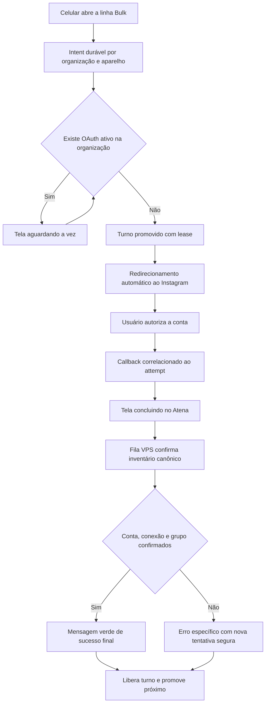

# Incidente Zernio — teste simultâneo de cinco celulares

## Escopo do teste

Linhas geradas pelo Bulk Zernio para o grupo `dani`:

```text
AidanMelek4882;dani
AidanMelek4882;dani
ArnettaGrenon258761;dani
ArnettaGrenon258761;dani
BoysieNegley8844;dani
```

As cinco linhas produziram cinco attempts independentes no Atena. Não houve
deduplicação indevida entre celulares neste teste.

## Resultado observado

| Conexão | Solicitações | Contas canônicas criadas na Zernio | Estado no Atena |
|---|---:|---:|---|
| AidanMelek4882 | 2 | 1 — `@velvetzen4285` | ausente devido à rejeição do callback sem `state` |
| ArnettaGrenon258761 | 2 | 0 | nenhuma conta remota para recuperar |
| BoysieNegley8844 | 1 | 1 — `@cyberzen3517` | ausente devido à rejeição do callback sem `state` |

## Evidências confirmadas

### AidanMelek4882

- conexão Atena: `f5e0bc7d-a47d-4cfd-b16f-d6404a8741c4`;
- profile canônico Zernio: `6a82344456025122388c6303`;
- conta remota ativa: `@velvetzen4285`;
- account ID: `6a82380b77555aae0169f932`;
- o `profileId` remoto corresponde exatamente ao profile canônico;
- dois attempts separados foram criados;
- ambos os callbacks foram rejeitados porque a Zernio não retornou `state`;
- o inventário local permaneceu vazio porque o worker não foi enfileirado.

### ArnettaGrenon258761

- conexão Atena: `cd06e3b7-efc4-48c3-8201-bc09e6fc74e2`;
- profile canônico Zernio: `6a7fd441b54b883eb6f20b8a`;
- dois attempts separados foram criados;
- ambos chegaram ao callback sem `state` e foram marcados como falha;
- a consulta remota posterior retornou zero contas Instagram;
- portanto não existe atualmente uma conta remota que possa ser recuperada.

### BoysieNegley8844

- conexão Atena: `cfff9246-8d6c-4671-9535-ee4ca1d70fc3`;
- profile canônico Zernio: `6a8225be57dd9fefe1ea8e9b`;
- conta remota ativa: `@cyberzen3517`;
- account ID: `6a82380b77555aae0169f936`;
- o `profileId` remoto corresponde exatamente ao profile canônico;
- o callback foi rejeitado porque a Zernio não retornou `state`;
- o inventário local permaneceu vazio porque o worker não foi enfileirado.

## Falha confirmada no Atena

O callback já possui correlação persistida por organização, usuário, `turnId`
e `attemptId`. Mesmo assim, a validação ainda exige que a Zernio devolva um
parâmetro `state`. Neste teste, os cinco callbacks voltaram sem esse parâmetro.

Essa exigência transformou retornos válidos do provedor em falhas antes do
enfileiramento do worker. Nos casos Aidan e Boysie, a conta foi criada
remotamente, mas não foi persistida no Atena.

## O que ainda não está comprovado

O callback sem `state` explica por que as contas não chegaram ao Atena, mas não
explica sozinho por que apenas uma das duas autorizações de Aidan e nenhuma das
duas autorizações de Arnetta criaram conta remota.

Para as três autorizações sem conta remota, as hipóteses prioritárias são:

1. o Instagram/Zernio devolveu o usuário ao callback sem concluir a vinculação;
2. duas autorizações simultâneas reutilizaram o mesmo profile Zernio e uma
   substituiu, cancelou ou invalidou a outra no provedor;
3. o fluxo remoto exibiu sucesso ao navegador antes da persistência definitiva;
4. houve falha específica do Instagram não propagada nos parâmetros do callback;
5. a serialização por profile foi removida para permitir dois slots paralelos,
   mas a Zernio pode não suportar dois OAuth simultâneos no mesmo profile.

Não há evidência para afirmar qual dessas hipóteses é a causa definitiva sem
inspecionar os callbacks completos persistidos, turnos, timestamps e o
comportamento do endpoint remoto durante as duas autorizações concorrentes.

## Decisão aprovada para correção

O fluxo será serializado em FIFO por organização. Cada empresa poderá ter apenas
uma autorização Zernio em andamento, enquanto organizações diferentes continuarão
processando em paralelo. O PostgreSQL será a fila durável; não será introduzido
Kafka.

A experiência no celular terá três estados explícitos:

1. **Aguardando a vez:** se outra autorização da mesma organização estiver ativa,
   o celular exibirá uma tela de espera responsiva, com posição/estado atualizado
   automaticamente. Ao ser promovido, o navegador seguirá para o Instagram sem
   exigir novo clique.
2. **Concluindo no Atena:** depois da autorização no Instagram e do callback, o
   celular permanecerá em uma tela curta de processamento enquanto a VPS confirma
   o inventário remoto, persiste a conta, associa o grupo e encerra a reserva.
3. **Sucesso final:** a mensagem verde só aparecerá após a conta existir no Atena,
   estar vinculada à conexão canônica correta e ter a associação ao grupo
   concluída. Somente nesse ponto a tela informará que o celular pode ser fechado.

O retorno do OAuth, isoladamente, não será apresentado como sucesso nem como
“entrou na fila”. Se o processamento terminar em conflito, ausência de conta ou
falha, a tela mostrará um estado específico e legível, sem mensagem verde falsa.

### Fluxo alvo



### Etapas de implementação

1. Restaurar uma fila FIFO exclusiva por organização com advisory lock,
   promoção atômica, lease, timeout e recuperação após crash. O índice de
   exclusividade deverá impedir mais de um turno OAuth ativo por organização.
2. Separar item aguardando de reserva ativa: solicitações na fila não consumirão
   slot reservado de longa duração; a reserva será criada ou confirmada apenas na
   promoção do turno.
3. Substituir o retorno de espera tratado como erro por uma página de status
   autenticada e específica do attempt. Ela consultará um endpoint restrito à
   organização e ao usuário da solicitação e redirecionará automaticamente quando
   o turno for promovido.
4. Remover a obrigatoriedade do `state` no callback final da Zernio. A segurança
   permanecerá baseada em organização, usuário, `turnId`, `attemptId`, vínculo
   persistido e uso único. Quando `profileId` e `accountId` forem retornados, eles
   deverão corresponder ao profile canônico e a uma conta não pertencente ao
   baseline.
5. Persistir diagnóstico sanitizado dos parâmetros do callback, inclusive a
   ausência de `state`, sem armazenar tokens ou segredos em logs de interface.
6. Após o callback, redirecionar para a página móvel de conclusão. Essa página
   fará polling limitado do estado do attempt e não exibirá sucesso enquanto o
   worker estiver `pending` ou `processing`.
7. Fazer o worker confirmar, em ordem: conta remota nova no profile canônico,
   reconciliação no Atena, vínculo com a conexão correta, associação ao grupo
   solicitado, atualização de slots, histórico e encerramento do turno.
8. Liberar e promover o próximo turno em qualquer estado terminal, incluindo
   sucesso, conflito, vazio, cancelamento, timeout e falha após tentativas. Uma
   autorização abandonada não poderá bloquear indefinidamente a organização.
9. Criar apresentação móvel dedicada com contraste adequado, área segura para
   celulares, indicador de progresso, textos curtos, botão de nova tentativa
   somente em falha e mensagem verde exclusivamente no sucesso final.
10. Remover da interface a mensagem atual que permite fechar o celular logo após
    o callback. O histórico administrativo continuará mostrando cada transição e
    diagnóstico técnico separadamente.
11. Recuperar `@velvetzen4285` e `@cyberzen3517` por account ID e profile canônico,
    associando ambas ao grupo `dani`. Nenhum DELETE remoto será executado.
12. Marcar as três autorizações sem conta remota como falhas recuperáveis, sem
    criar perfis fictícios e sem consumir slot permanente.
13. Cobrir com testes: callback sem `state`, callback repetido, profile divergente,
    FIFO por organização, paralelismo entre organizações, promoção após timeout,
    crash do worker, associação ao grupo e 500 intents concorrentes.
14. Executar build e testes, aplicar migration, publicar aplicação e worker e
    realizar smoke test controlado antes de liberar novo teste massivo.

### Critério visual e funcional de sucesso no celular

A caixa verde final deverá significar simultaneamente:

- conta confirmada no inventário remoto da Zernio;
- conta persistida no Atena;
- `accountId` e `profileId` compatíveis com a conexão canônica;
- grupo solicitado associado, quando houver;
- slot e histórico atualizados;
- turno encerrado e próximo item liberado.

Antes disso, o celular verá estados neutros de espera/processamento, nunca uma
confirmação verde antecipada.

## Invariantes preservadas

- uma conta só pode ser persistida na conexão cujo profile canônico corresponda
  exatamente ao `account.profileId` remoto;
- conta ambígua ou ausente não é inventada nem atribuída por fallback;
- nenhum DELETE remoto será executado para resolver este incidente;
- solicitações de celulares diferentes continuam independentes;
- grupo e conexão solicitados permanecem vinculados à intent original.

## Resultado final da correção

Correção, recuperação e publicação concluídas em 16 de agosto de 2026.

### Dados recuperados

- `@velvetzen4285` foi persistida no perfil local
  `74337a04-ff89-44a4-b0ac-f63e7662566f`, mantendo a conexão e o profile Zernio
  canônicos, e foi associada ao grupo `dani`;
- `@cyberzen3517` foi persistida no perfil local
  `7f763e9b-6e9d-45d2-9415-d68e7bdabf02`, mantendo a conexão e o profile Zernio
  canônicos, e foi associada ao grupo `dani`;
- o attempt Aidan `6d4c88aa-bae1-4bf2-a549-9c3e7818861b` foi escolhido
  deterministicamente como o representante da conta recuperada por ter o primeiro
  callback terminal (`failed_at`) entre os dois attempts Aidan;
- o attempt Boysie `fbc53701-c0b7-4b5e-b0de-38e7be5b78e2` foi reconciliado como
  concluído;
- exatamente três attempts permaneceram como falhas recuperáveis: os dois Arnetta
  e o segundo Aidan. Nenhum perfil fictício foi criado e nenhum DELETE remoto foi
  executado.

### Publicação e validação

- migration `152_zernio_organization_oauth_fifo_and_deferred_reservations.sql`
  aplicada no PostgreSQL de produção;
- aplicação publicada na Vercel e alias de produção atualizado;
- worker de adições publicado em `/opt/athena-worker`, validado pelo Node, reiniciado
  no PM2 e confirmado como `online`;
- suíte Node: 103 testes aprovados;
- modelo de concorrência: 500 celulares processados em FIFO com máximo de um OAuth
  ativo por organização, além de paralelismo independente entre organizações;
- build Next.js de produção aprovado localmente e na Vercel;
- smoke HTTP confirmou que a nova rota móvel está publicada e protegida por login;
- auditoria final confirmou dois attempts recuperados, três recuperáveis, dois
  perfis canônicos no grupo `dani` e zero turnos ativos órfãos após a manutenção
  da fila.

O teste SQL local continuou indisponível pela ausência de Docker/PostgreSQL local,
mas a migration foi compilada e aceita diretamente pelo PostgreSQL remoto de
produção.
