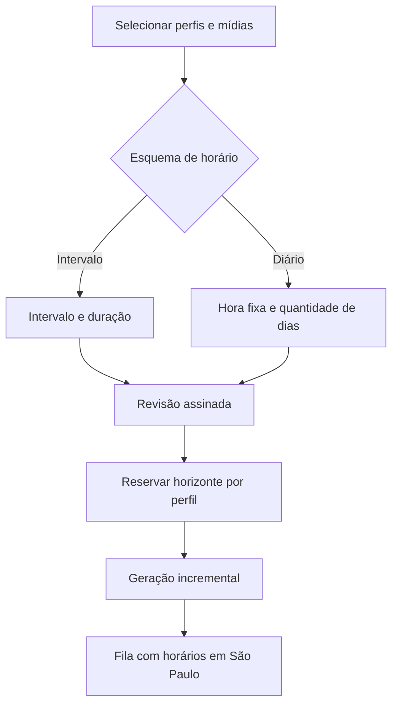

# Plano — correção de filas Story e horário diário na programação em massa

## Objetivo

Corrigir as filas Story indicadas, eliminando a fila indevida e recriando as demais em uma cadência de uma postagem por dia às 21:00 no fuso `America/Sao_Paulo`. Evoluir a seção **Programar em massa** de `/postagem` com um modo alternativo de agendamento diário em horário fixo, mantendo o modo atual de intervalo e duração sem regressões.

## Diagnóstico confirmado

- A implementação atual recebe somente `intervalMinutes` e `durationDays` no cliente e nas rotas de revisão/confirmação.
- A quantidade de slots é calculada por `floor(duração em minutos / intervalo)`. Por isso, `1440` cria um slot por dia e `1400` desloca o horário ao longo dos dias; nenhum desses campos expressa diretamente o horário diário desejado, como 21:00.
- A primeira execução atual é calculada após o maior valor entre agora, a última publicação ativa do perfil e a última reserva de horizonte. Portanto, não há um campo para ancorar o calendário em uma hora específica.
- O cancelamento de um lote é suportado pela fila e deve ocorrer antes da recriação, para que as reservas de horizonte sejam liberadas e não concorram com os novos horários.
- O compositor de grupos já possui lógica de recorrência por horário diário e normalização para São Paulo. Ela deve orientar a nova semântica, porém a programação em massa precisa manter seu próprio contrato compacto e processamento incremental.

## Operação solicitada

1. Localizar os lotes pelos nomes exatos na fila e registrar identificadores, perfis, status, total de itens e próximos horários como evidência antes da alteração.
2. Cancelar integralmente o lote `17-08 35 LOIRINHA STORY 3` usando o fluxo transacional existente de cancelamento de lote.
3. Cancelar as programações ativas dos três lotes abaixo e recriá-las com o mesmo conjunto de perfis, origem de mídia, formato Story, legenda e política de rotação registrada nos planos originais:
   - `STORY TESTE DANI 17-08`
   - `15-08 35 LOIRINHA STORY 2`
   - `STORY OFICIAL DANI 17-08 120MIN`
4. Criar as três novas filas, uma por dia, às 21:00 de São Paulo, começando em 17/08/2026. A ordem seguirá a lista acima.
5. Verificar após a geração que cada perfil afetado possui exatamente um item Story em cada data prevista às 21:00, sem conflito por minuto, e guardar o resultado da operação.

> A operação destrutiva/reagendamento somente será feita após aprovação explícita. A ocupação deve ser avaliada por perfil — não pela soma de lotes. Cada perfil possui o seu próprio par de Story e Reel. O lote Story duplicado indicado pelo usuário será removido antes de ajustar o Story que deve permanecer; não se deve cancelar um lote inteiro adicional apenas por haver outros lotes ativos na organização.

## Novo modo na tela Programar em massa

### Experiência da interface

1. Incluir um seletor de esquema de horários em `Configuração do lote`:
   - `Intervalo contínuo` como padrão, preservando os campos atuais Intervalo e Duração.
   - `Uma vez por dia em horário fixo` como modo novo.
2. Quando o modo diário estiver ativo, ocultar Intervalo e Duração e exibir:
   - campo `Horário diário`, no formato `HH:mm`, inicialmente `21:00`;
   - campo `Quantidade de dias`, inteiro positivo;
   - texto de apoio explicando que cada perfil receberá uma publicação por dia nesse horário, no fuso de São Paulo.
3. Atualizar a projeção, a revisão modal e o cartão de acompanhamento para mostrar o esquema escolhido, o horário diário e a faixa calculada de primeira/última execução.
4. Invalidar a revisão assinada sempre que o esquema, horário ou quantidade de dias for modificado. Incluir os novos campos na indicação de rascunho e restaurar valores padrão ao limpar.
5. Manter acessibilidade existente: rótulos associados, controles desabilitados quando sem permissão e foco do modal preservado.

### Contrato, validação e segurança

1. Expandir o tipo e parser de requisição compacta com um discriminador de esquema, por exemplo `scheduleMode: interval | daily_time`.
2. Para `interval`, manter obrigatórios `intervalMinutes` e `durationDays`, com as regras atuais.
3. Para `daily_time`, validar `dailyTime` estritamente como `HH:mm` entre `00:00` e `23:59`, validar `repeatDays` como inteiro positivo e rejeitar campos ou combinações ambíguas.
4. Incluir todos os novos campos no fingerprint do token de revisão e no hash de idempotência do banco, de modo que uma confirmação não possa trocar silenciosamente o horário revisado.
5. Usar `America/Sao_Paulo` como fuso explícito de resolução e tratar corretamente transições de calendário; a API e banco devem persistir instantes UTC já resolvidos.

### Persistência e geração incremental

1. Criar uma migration incremental que permita armazenar o esquema e, para o diário, horário local e total de dias no plano. Preservar as colunas e planos legados de intervalo.
2. Evoluir as funções de revisão e criação de plano para aceitar ambos os esquemas.
3. Para o esquema diário, calcular para cada perfil o primeiro horário futuro correspondente a `dailyTime` em São Paulo, respeitando a maior ocupação ativa e reserva existente:
   - se 21:00 do dia atual ainda estiver disponível no futuro, começar hoje;
   - caso contrário, avançar para o próximo dia disponível às 21:00;
   - avançar por dias de calendário, nunca por 1.440 minutos fixos, evitando mudança indesejada de hora em regras de fuso.
4. Gerar `repeatDays` slots, sempre na mesma hora local, e reservar o horizonte entre primeira e última execução com a mesma garantia atômica por perfil do modo atual.
5. Adaptar o worker gerador para resolver `execute_at` pelo índice do slot e pelo esquema persistido; rotação de mídia, chunks, idempotência, pausas e retomadas permanecem iguais.
6. Definir a política de conflito para o novo recurso: se o horário diário de um perfil já estiver ocupado por uma publicação do **mesmo perfil**, pular apenas para o próximo dia livre, preservando uma publicação diária e registrando a faixa efetiva que será mostrada na revisão. Essa política não será acionada na correção operacional atual, pois a fila duplicada será cancelada primeiro e os perfis foram confirmados como livres.

## Testes e validação

1. Testar utilitários de calendário diário para hoje antes/depois do horário, virada de mês/ano, datas já ocupadas e comparação com reservas ativas.
2. Estender testes de parser, fingerprint e token para os dois esquemas e rejeições do formato de horário.
3. Criar testes SQL de revisão/criação para um slot por dia no mesmo horário de São Paulo, slots consecutivos, deslocamento por conflito e reservas sem sobreposição.
4. Testar a geração incremental e a retomada para que os itens persistam 21:00 local em todos os dias solicitados e não dupliquem em reprocessamento.
5. Executar validação de tipos, lint e testes relevantes; revisar manualmente a projeção e a confirmação de ambos os modos em `/postagem`.

## Arquivos previstos

- `app/postagem/bulk-publishing-client.tsx` — seletor, campos, projeção e revisão.
- `lib/publications/bulk-api.ts` — contrato, parser e fingerprint.
- `lib/publications/bulk-rotation.ts` — abstrações de esquema e cálculos/testes unitários.
- `app/api/bulk-publications/review/route.ts` — revisão do novo esquema.
- `app/api/bulk-publications/confirm/route.ts` — criação do plano diário.
- `supabase/migrations/<nova_migration>.sql` — persistência e funções de revisão/criação/geração.
- `supabase/tests/<novo_teste>.test.sql` — garantias transacionais e de horário diário.

## Fluxo

## Critérios de aceite

- O modo atual continua produzindo exatamente a mesma programação para requisições existentes.
- No modo diário, um pedido de 3 dias às 21:00 gera três horários em dias consecutivos às 21:00 de São Paulo para cada perfil, salvo conflito explícito.
- O modal de revisão informa claramente horário local, quantidade de dias, primeira e última execução efetivas.
- Nenhum perfil recebe duas postagens no mesmo minuto, nem há sobreposição de horizonte entre planos concorrentes.
- A fila `17-08 35 LOIRINHA STORY 3` fica cancelada e as outras três são recriadas em ordem, uma por dia às 21:00, após autorização e confirmação da data inicial.
