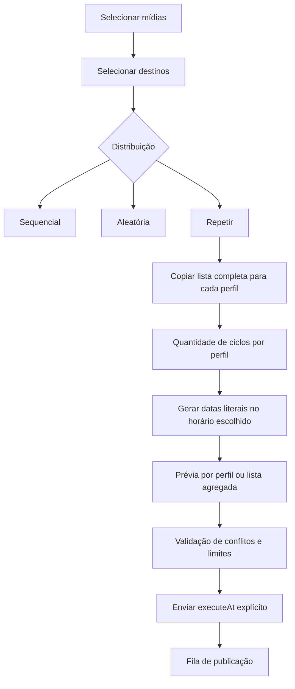

# Plano — distribuição Repetir no compositor Programar

## Decisão confirmada

O escopo é a distribuição em massa do compositor convencional de **Programar**, implementada em [`app/postagem/group-composer-next.tsx`](../app/postagem/group-composer-next.tsx). Não altera a rotação compacta de **Programar em massa**, cuja semântica, persistência e geração incremental são independentes em [`app/postagem/bulk-publishing-client.tsx`](../app/postagem/bulk-publishing-client.tsx) e [`lib/publications/bulk-rotation.ts`](../lib/publications/bulk-rotation.ts).

Será incluída a terceira opção de distribuição, **Repetir**, preservando sem alteração as opções existentes **Sequencial** e **Aleatória**.

| Regra | Comportamento aprovado |
| --- | --- |
| Distribuição Repetir | Cada perfil de destino recebe a lista completa de mídias selecionadas. |
| Ordem | Todos os perfis recebem exatamente a mesma ordem selecionada na biblioteca. |
| Quantidade | O campo será **Repetir a sequência** e representará ciclos completos por perfil, não dias. |
| Exemplo | 10 mídias, 55 perfis e sequência repetida 10 vezes produzem `10 × 10 × 55 = 5.500` publicações. Cada perfil recebe 100 publicações. |
| Horário | O horário escolhido, por exemplo 09:00, é literal e exato em todos os perfis. Não haverá sorteio dentro da janela 09:00–09:09. |
| Ordem temporal | Cada perfil publica uma mídia por dia no horário configurado; depois da mídia 10, retorna à mídia 1 no dia seguinte disponível. |
| Conflitos | Um horário já ocupado para determinado perfil não sobrescreve nem duplica publicação: aquela ocorrência avança para o próximo dia disponível para aquele perfil. |

## Diagnóstico do comportamento atual e regras que não podem ser mescladas

### Distribuição atual

Hoje o tipo de distribuição em [`BulkConfig`](../app/postagem/group-composer-next.tsx:94) aceita somente `sequential` e `random`. A função [`distributeMediaBetweenProfiles()`](../lib/publications/composer.ts:201) reparte os itens em rodízio entre destinos. Com 10 mídias e 55 perfis, apenas os primeiros 10 destinos recebem uma mídia; os demais ficam sem plano. Isso é correto para **Sequencial/Aleatória**, mas incompatível com o novo objetivo de replicar o conjunto por perfil.

### Repetição atual

O controle atual de repetição usa **dias** em [`BulkConfig.repeatDays`](../app/postagem/group-composer-next.tsx:101), calcula `horários por dia × dias` em [`recurringPublicationSlotCount()`](../lib/publications/composer.ts:197) e monta uma lista circular em [`buildRepeatedPublicationSchedule()`](../lib/publications/composer.ts:302). Portanto, ele não expressa ciclos completos de mídias.

O novo campo **Repetir a sequência** será específico da distribuição **Repetir**. Ele não deve reutilizar, renomear ou modificar a repetição individual de dias, pois ela continua válida para os cards exibidos individualmente.

### Horário recorrente atual

No envio convencional, itens recorrentes transportam `scheduleTime` e `scheduleBaseAt` em [`PublishingClient.submit()`](../app/postagem/publishing-client.tsx:236). A função SQL atual [`queue_publication_batch()`](../supabase/migrations/046_enforce_recurring_publication_windows.sql:5) sorteia o minuto real entre `xx:01` e `xx:09` para cada janela recorrente em [`queue_publication_batch()`](../supabase/migrations/046_enforce_recurring_publication_windows.sql:72).

Essa regra contradiz a confirmação de 09:00 exato. Para o novo fluxo, os itens precisam ser enviados como `executeAt` explícito e exato, sem `scheduleTime`, para que o banco mantenha o instante literal e a proteção existente por minuto.

### Cards individuais versus perfis ocultos

Os cards individuais já possuem a lista de horários resolvidos em [`ProfilePlanCard`](../app/postagem/group-composer-next.tsx:414). A nova preferência de visualização deve ser apenas de interface: ocultar os cards não pode eliminar planos, mídias, horários, validações ou itens enviados.

Quando os cards estiverem ocultos, um novo painel agregado exibirá todos os horários gerados, agrupados por perfil e limitados inicialmente para não travar a tela. Ele deverá oferecer total por perfil, primeira e última publicação, página ou expansão progressiva e indicador de itens restantes.

## Arquitetura proposta

## Implementação planejada

### 1. Modelo e funções puras

Alterar [`lib/publications/composer.ts`](../lib/publications/composer.ts) para:

1. Estender o tipo de distribuição com `repeat` sem mudar o algoritmo atual de `sequential` e `random`.
2. Criar uma função pura dedicada para distribuir a lista completa a cada destino no modo `repeat`, preservando a ordem de `selectedMediaIds` e sem compartilhar arrays mutáveis entre perfis.
3. Criar normalizador, mínimo e máximo explícitos para a quantidade de ciclos. O valor deve ser inteiro positivo e limitado por uma constante centralizada.
4. Criar gerador de agendamento **literal diário** para uma sequência: recebe quantidade de itens, horário São Paulo, ocupações do perfil e retorna instantes exatos no horário configurado. Ele deve pular somente dias conflitados e não usar a regra de janela aleatória.
5. Criar utilitário de projeção com: mídias por ciclo, ciclos, publicações por perfil, total de perfis, total global, primeira e última data prevista.

### 2. Estado e aplicação do modo Repetir

Alterar [`app/postagem/group-composer-next.tsx`](../app/postagem/group-composer-next.tsx) para:

1. Adicionar `repeat` a [`BulkConfig`](../app/postagem/group-composer-next.tsx:94) e introduzir um campo independente, por exemplo `sequenceRepeatCount`.
2. Exibir a opção **Repetir** no seletor **Distribuição**.
3. Mostrar o campo **Repetir a sequência** exclusivamente quando a distribuição for Repetir. Remover do novo fluxo a leitura e o texto de repetição em dias; não alterar o controle já existente nos cards individuais.
4. No modo Repetir, restringir o agendamento a recorrente com exatamente um horário diário. A interface deve explicar: um horário significa uma mídia por perfil por dia. Se for necessário mais de um horário por dia, isso será uma evolução futura com uma regra explícita de ordem.
5. Gerar por destino a lista `mídias selecionadas × ciclos`, preservando a ordem por ciclo.
6. Para cada destino, gerar `executeAt` exato para cada item com o novo gerador literal. Não preencher `scheduleTime` nesse modo.
7. Preservar as opções **Substituir** e **Adicionar ao plano**. Em `Substituir`, limpar somente os planos dos destinos selecionados; em `Adicionar`, anexar mídias e recalcular a sequência de forma explícita, sem reaproveitar horários antigos nem duplicar o mesmo minuto.
8. Bloquear a aplicação se houver mídia incompatível, nenhum destino, nenhum item elegível, horário ausente, ciclos inválidos, plano impossível ou projeção acima do limite do endpoint.

### 3. Prévia e opção de ocultar perfis

No mesmo componente:

1. Adicionar uma preferência local **Exibir perfis individualmente** com valor padrão ligado, persistida em `localStorage` e acessível por checkbox.
2. Com a opção ligada, manter os cards atuais sem regressão.
3. Com a opção desligada, ocultar somente a renderização de [`ProfilePlanCard`](../app/postagem/group-composer-next.tsx:253), sem apagar `plans`, `profileIds`, seleção de mídias ou resultados calculados.
4. Exibir uma nova seção **Horários programados** contendo listas por perfil com: nome, quantidade, sequência de mídia, data/hora São Paulo, primeira/última ocorrência e paginação ou expansão progressiva.
5. Para planos grandes, não renderizar milhares de linhas de uma vez: mostrar uma amostra inicial por perfil, botão de expandir e total restante. A prévia de confirmação usará totais agregados e uma amostra, em vez de materializar toda a interface.
6. A modal **Revisar distribuição** deverá identificar o modo Repetir e informar de forma inequívoca `N mídias × C ciclos × P perfis = T publicações`, além do horário exato e da faixa prevista.

### 4. Segurança no envio e limites

Manter o contrato em [`app/api/publications/route.ts`](../app/api/publications/route.ts):

1. O novo modo produzirá itens convencionais com `executeAt` explícito, validados como futuros e submetidos à mesma RPC de fila.
2. A proteção de conflito por minuto já existente em [`queue_publication_batch()`](../supabase/migrations/046_enforce_recurring_publication_windows.sql:94) continuará atuando por perfil, independentemente de formato e lote.
3. Aplicar a projeção antes de montar itens. O código deve respeitar [`maximumPublicationInputItems`](../app/api/publications/route.ts:14) e [`maximumAsyncPublicationItems`](../app/api/publications/route.ts:15). Caso extrapole, impedir a confirmação com mensagem calculada; não truncar mídia, ciclo ou perfil silenciosamente.
4. Para volumes acima do limite síncrono e dentro do assíncrono, preservar o job de geração existente em [`app/api/publications/route.ts`](../app/api/publications/route.ts:465).
5. O uso explícito de `executeAt` não deve passar por `scheduleTime`; assim o banco não randomiza 09:00 para outro minuto.

### 5. Regras de compatibilidade e casos especiais

1. **Imagem/Reel/Story:** aplicar apenas mídias compatíveis antes de calcular os ciclos. Qualquer mídia incompatível deve aparecer no aviso e não integrar o total projetado.
2. **Carrossel:** a distribuição em massa atual oferece somente imagem, reel e story. O plano não amplia isso para carrossel.
3. **Uso único:** `repeat` replica mídias entre perfis, portanto é incompatível com grupos de consumo `single_use`. A UI deve desabilitar Repetir para esse tipo de grupo e explicar o motivo. A validação de servidor existente continua como camada de defesa.
4. **Perfil já ocupado:** a geração local deve pular o dia ocupado para aquele perfil. Se houver disputa concorrente entre revisão e envio, o banco rejeita o conflito; a interface deve conservar o rascunho e instruir a recalcular a prévia.
5. **Horário passado:** se 09:00 já passou no dia de criação, a primeira ocorrência inicia no próximo dia disponível às 09:00; nunca deve criar execução retroativa ou imediata.
6. **Fuso:** todos os cálculos e textos usam `America/Sao_Paulo`, com datas transmitidas em ISO UTC correspondentes ao horário local exato.

## Matriz de testes obrigatórios

Adicionar testes unitários em [`lib/publications/composer.test.ts`](../lib/publications/composer.test.ts) e testes de interface ou integração onde a base atual permitir:

| Caso | Resultado esperado |
| --- | --- |
| Sequencial existente | Mantém a divisão alternada atual e não recebe regressão. |
| Aleatória existente | Mantém embaralhamento determinável via fonte injetada. |
| Repetir, 10 mídias e 55 perfis | Cada perfil recebe as mesmas 10 mídias na mesma ordem. |
| Repetir sequência 10 vezes | Cada perfil recebe 100 publicações; o total é 5.500. |
| Uma mídia e 3 ciclos | O mesmo item é previsto por 3 dias no horário exato. |
| Duas mídias e 2 ciclos | A ordem por perfil é M1, M2, M1, M2. |
| 09:00 exato | Instantes previstos correspondem a 09:00:00 em São Paulo, sem minutos aleatórios. |
| Horário de hoje já passado | A primeira execução é no próximo dia disponível. |
| Conflito em 09:00 para um perfil | Apenas esse perfil avança para o próximo dia livre, sem colisão. |
| Ocultar perfis | Planos e itens enviados são idênticos aos do modo visível. |
| Limite do endpoint | Projeção acima de 50.000 bloqueia antes do envio com mensagem objetiva. |
| Uso único | Repetir não pode ser aplicado e não duplica mídia entre perfis. |
| Rejeição concorrente no banco | O rascunho permanece e a pessoa consegue revisar novamente. |

## Critérios de aceite

1. A lista de distribuição apresenta **Sequencial**, **Aleatória** e **Repetir**.
2. Com 10 mídias, 55 destinos, horário 09:00 e sequência 10, cada destino tem 100 itens e o lote possui 5.500 itens.
3. Para cada perfil, a ordem é as 10 mídias selecionadas repetidas exatamente 10 vezes.
4. Os horários de cada perfil são diários e exatos às 09:00 em São Paulo, começando no próximo instante futuro elegível.
5. As regras existentes de distribuição, agendamento individual, legenda, conflito e fila continuam funcionando.
6. Ocultar perfis não perde dados e exibe a lista alternativa de horários de modo performático.
7. A prévia, a confirmação e a fila exibem totais coerentes, sem truncamento oculto.
8. A suíte de testes atual e os novos cenários passam antes da entrega.

## Fora de escopo nesta alteração

- Modificar a rotação compacta de **Programar em massa**.
- Alterar a aleatorização histórica de horários recorrentes dos cards individuais.
- Permitir múltiplos horários diários no modo Repetir sem antes definir a regra de preenchimento e os efeitos de capacidade.
- Alterar a arquitetura do worker de publicação.
