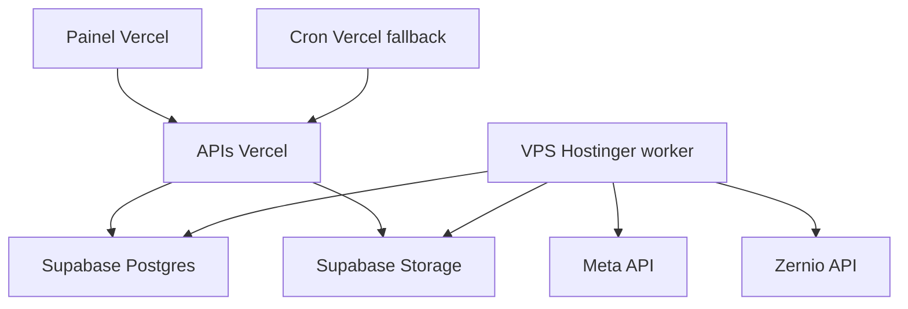
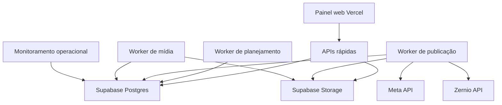

# Plano de escala — filas, workers e ações em massa

## Objetivo

Preparar o sistema para operar com pelo menos 10 empresários, 300 Instagrams por empresário e 1 postagem por hora em cada Instagram.

Capacidade alvo:

- 3.000 perfis de Instagram.
- 3.000 publicações por hora.
- 72.000 publicações por dia.
- 2.160.000 publicações por mês de 30 dias.

Esse volume exige tratar o sistema como uma plataforma de filas contínuas, não como um conjunto de ações síncronas disparadas por tela.

## Diagnóstico resumido

### Gargalos atuais de publicação

- A criação de publicações limita o payload a 500 itens em `app/api/publications/route.ts`.
- A seleção expandida por grupo também é bloqueada acima de 500 itens em `app/api/publications/route.ts`.
- O dispatcher de publicação limita cada execução a 5 itens em `lib/publications/dispatcher.ts`.
- O cron de publicação roda a cada minuto em `vercel.json`.
- O endpoint interno do worker tem `maxDuration = 60` em `app/api/internal/publication-dispatch/route.ts`.
- O claim no banco suporta até 100 itens por chamada, mas a aplicação limita para 5.
- A recuperação de agendamentos vencidos existe, mas precisa ser tratada como contingência, não como fluxo normal.

### Gargalos atuais de telas

- Agenda carrega 250 itens fixos, sem paginação real por período.
- Operação calcula diagnóstico lendo até 1000 itens ativos.
- Dashboard limita perfis a 200, abaixo do alvo de 300 por empresário.
- Página de postagem carrega todos os agendamentos futuros ativos para montar métricas por perfil.
- Fila visual carrega lotes pequenos e filtra muitos dados no cliente.

### Gargalos atuais de mídia e galeria

- Upload do navegador trabalha com 2 uploads concorrentes.
- Preparação de mídia ocorre 1 item por vez.
- Upload individual pode passar arquivo pela API serverless.
- Exclusão em massa já tem bom padrão com job assíncrono e deve servir de referência para agendamentos grandes.

## Decisão arquitetural recomendada

Adotar arquitetura híbrida:

- Vercel continua responsável por telas, autenticação, APIs rápidas, criação de jobs e consultas paginadas.
- Workers dedicados fora da Vercel ficam responsáveis por publicação, geração de agendamentos grandes, retries, recuperação, processamento pesado de mídia e ações em massa.

## Avaliação da VPS Hostinger existente

Dados observados nas imagens enviadas:

- Plano KVM 1.
- Ubuntu 24.04 LTS.
- 1 núcleo de CPU.
- 4 GB de memória.
- 50 GB de disco.
- 4 TB de largura de banda.
- Uso atual baixo de CPU, memória e disco.

Conclusão: essa VPS atende como primeiro worker dedicado para tirar a operação crítica da Vercel, especialmente publicação contínua, recuperação de leases e execução de jobs pequenos ou médios. Ela não deve ser considerada capacidade final para 3.000 publicações por hora sem medição real, porque 1 núcleo de CPU limita processamento paralelo, compressão, geração de thumbnails, logs e múltiplos workers concorrentes.

Uso recomendado dessa VPS:

- Worker de publicação contínua.
- Worker de recuperação de fila e leases expirados.
- Worker de geração de agendamentos em chunks moderados.
- Monitoramento básico com logs persistentes.
- Fallback operacional quando o cron da Vercel falhar.

Uso não recomendado como primeira etapa nessa VPS:

- Processamento pesado de vídeo.
- Muitos workers paralelos de mídia.
- Banco de dados local para dados principais.
- Armazenamento local de mídias finais.
- Execução sem supervisão, logs e restart automático.

Arquitetura com a VPS existente:



## O que acontece com postagens já agendadas

As postagens já agendadas ficam preservadas no Supabase. A migração não deve apagar nem recriar `publication_items` existentes. A mudança correta é trocar quem processa a fila, não trocar a fila inteira.

Estratégia segura:

- Manter `publication_items`, `publication_batches`, `publication_item_media` e eventos existentes.
- Subir o worker da VPS primeiro em modo observação, sem publicar.
- Validar conexão com Supabase, contagens de fila e permissões.
- Ativar o worker da VPS com concorrência baixa.
- Manter o cron da Vercel como fallback no início.
- Evitar dois motores agressivos publicando ao mesmo tempo.
- Usar o claim transacional com `for update skip locked`, que já evita que dois workers peguem o mesmo item.
- Monitorar itens em `preparing`, `publishing`, `failed`, leases vencidos e atrasos.
- Só depois reduzir ou desativar o cron da Vercel como motor principal.

Plano de corte seguro:

1. Aplicar migrations de observabilidade e configuração sem alterar status de publicações existentes.
2. Instalar worker na VPS com variáveis de ambiente de produção.
3. Rodar comando de diagnóstico somente leitura.
4. Rodar worker em modo dry run.
5. Rodar worker real com concorrência 1 ou 2.
6. Confirmar que itens já agendados mudam normalmente de `waiting` para `preparing` e depois para `published` ou `failed`.
7. Aumentar concorrência gradualmente.
8. Manter Vercel cron como fallback até a VPS provar estabilidade.

## Acessos e dados necessários para preparar a VPS

Não é recomendado compartilhar senha root em conversa. Preferir chave SSH.

Necessário:

- Acesso SSH root ou usuário sudo.
- Chave SSH cadastrada na VPS.
- Repositório Git do projeto ou pacote de deploy.
- Variáveis de ambiente usadas em produção.
- Supabase URL.
- Supabase service role key.
- Supabase anon key se algum trecho precisar.
- Segredo do worker de publicação.
- Segredo do worker de exclusão de mídia se for usado.
- Variáveis da Meta e Zernio já usadas pelo projeto.
- Permissão para liberar saída HTTPS da VPS.
- Definição de branch que será implantada.

Comandos iniciais planejados para a VPS:

```bash
apt update && apt upgrade -y
apt install -y curl git ufw ca-certificates build-essential
curl -fsSL https://deb.nodesource.com/setup_20.x | bash -
apt install -y nodejs
npm install -g pm2
ufw allow OpenSSH
ufw --force enable
node -v
npm -v
pm2 -v
```

Comandos planejados para deploy do worker:

```bash
mkdir -p /opt/athena-worker
cd /opt/athena-worker
git clone REPOSITORIO_DO_PROJETO .
npm ci
npm run build
mkdir -p /etc/athena-worker
nano /etc/athena-worker/.env
pm2 start npm --name athena-publication-worker -- run worker:publication
pm2 save
pm2 startup
```

Esses comandos ainda dependem da criação do script real `worker:publication` no projeto.



## Por que não apenas aumentar crons

Crons são gatilhos, não workers contínuos. Aumentar cron pode gerar disputa por banco, excesso de chamadas, locks, rate limits e invocações concorrentes sem controle fino de backlog.

Com a configuração atual, o limite prático é aproximadamente 300 publicações por hora se mantido o teto de 5 itens por minuto. O alvo é 3.000 publicações por hora. Mesmo elevando o limite, funções serverless continuam presas a duração máxima, concorrência menos previsível e ausência de controle adaptativo por provedor, perfil e organização.

## Plano de implementação

### Fase 1 — Base de capacidade e limites configuráveis

- Criar tabela de configuração operacional por organização e global.
- Mover limites fixos para configuração controlada no banco.
- Registrar metas de throughput por organização, provedor e tipo de tarefa.
- Criar métricas de backlog, itens por status, atraso máximo, retries vencidos e leases expirados.
- Criar RPCs agregados para saúde da fila sem carregar milhares de linhas no servidor.

### Fase 2 — Jobs assíncronos para agendamento infinito

- Substituir o limite conceitual de 500 por jobs de geração de publicações.
- Criar tabela `publication_generation_jobs`.
- Criar tabela `publication_generation_job_chunks`.
- Criar tabela de eventos dos jobs de geração.
- Alterar a API de criação para aceitar plano grande e retornar `jobId`.
- Criar worker de planejamento para expandir perfis, grupos, mídias e recorrências em chunks.
- Inserir `publication_items` em chunks idempotentes.
- Permitir pausar, cancelar e retomar jobs de geração.

### Fase 3 — Worker dedicado de publicação

- Criar processo Node separado do runtime da Vercel.
- Reaproveitar a lógica atual de claim, publicação e conclusão.
- Remover dependência de cron como motor principal.
- Rodar loop contínuo com backoff quando não houver trabalho.
- Configurar concorrência por organização, provedor e perfil.
- Evitar processar duas publicações simultâneas do mesmo perfil quando houver risco de limite ou conflito.
- Transformar o endpoint interno atual em fallback, acionamento manual e health check.
- Registrar batimentos do worker em tabela própria.

### Fase 4 — Controle de rate limit e justiça entre clientes

- Criar quotas por organização.
- Criar controle por perfil.
- Criar controle por provedor `meta_official` e `zernio`.
- Aplicar backoff quando Meta ou Zernio retornarem erro temporário ou limite.
- Priorizar itens vencendo agora sem deixar uma organização monopolizar a fila.
- Registrar motivo de adiamento em eventos.

### Fase 5 — Refatoração das telas operacionais

- Agenda deve consultar por janela de datas, perfil, status e cursor.
- Operação deve usar agregações e paginação, não leitura fixa de 1000 linhas.
- Dashboard deve usar agregações por RPC e remover limite de 200 perfis como base funcional.
- Fila de postagem deve buscar itens paginados por filtro no servidor.
- Tela de postagem deve carregar métricas agregadas por perfil, sem puxar todos os agendamentos futuros.
- Adicionar tela de progresso dos jobs grandes com cancelamento e logs.

### Fase 6 — Galeria, upload e ações em massa

- Manter paginação por cursor na galeria.
- Trocar upload pesado para fluxo direto ao Storage com URL assinada quando possível.
- Criar job de processamento de mídia para thumbnails, checksum, metadados e validação.
- Transformar associação em massa de grupos em job quando passar de um limite configurado.
- Manter exclusão em massa assíncrona e expandir métricas de progresso.
- Criar proteção para não apagar mídia em uso por jobs de geração ainda pendentes.

### Fase 7 — Observabilidade e operação
 
- Criar painel de workers ativos.
- Exibir backlog por status, organização, provedor e faixa de atraso.
- Alertar worker parado.
- Alertar fila crescendo acima da capacidade configurada.
- Alertar muitos retries por perfil.
- Alertar rate limit por provedor.
- Registrar throughput real por minuto e por hora.

#### Complemento obrigatório — telemetria agregada de publicação

O aumento de escala não deve depender de logs detalhados de cada postagem. Registrar uma linha completa por item como métrica normal aumentaria escrita, custo e ruído justamente durante os picos. A observabilidade deve usar agregações duráveis e consultas por janela.

- Ao final de cada ciclo do worker, persistir somente o resumo: duração, itens reivindicados, publicados, falhos, adiados, suspensos, backlog e maior atraso observados.
- Consolidar por janela de 1, 5, 15 e 60 minutos as contagens por organização e provedor (`meta_official` e `zernio`).
- Agrupar erros por `provedor + código normalizado`, mantendo contagem, primeiro/último horário e amostra limitada de IDs afetados; não guardar tokens, URLs assinadas, mídia, payloads ou stack traces repetidos.
- Exibir separadamente adiamentos de justiça/rate limit, retries, leases expirados, itens presos em `preparing`/`publishing` e crescimento de backlog.
- Incluir p50/p95 de duração de ciclo/publicação, throughput, atraso médio/máximo e reinícios do processo publicador.
- Gerar alertas apenas por condições agregadas: worker sem heartbeat, backlog crescendo em janelas consecutivas, atraso acima da meta, falhas/429/5xx recorrentes ou leases expirados.
- Manter a tela de operação baseada em RPCs agregadas e cursor para detalhes; ela não deve carregar a fila inteira.

Meta operacional inicial para validar picos: o relatório deve permitir comparar a taxa de chegada com a taxa de drenagem e confirmar que o backlog retorna próximo de zero antes do pico seguinte. Para o cenário de 3 organizações com 500 posts simultâneos por hora, registrar a janela de drenagem, o atraso p95/p99 e os motivos de qualquer adiamento.

#### Auditoria futura orientada por IA

Depois de acumular uma janela representativa de operação real — incluindo picos de agendamentos em massa — executar uma auditoria técnica assistida por IA sobre os relatórios agregados e a documentação operacional.

O objetivo é verificar, com evidência mensurável, se a operação cumpriu as hipóteses de capacidade adotadas no projeto:

1. A fila drenou cada pico antes do pico seguinte?
2. O atraso p95/p99 permaneceu dentro da meta definida para cada tipo de postagem?
3. Houve crescimento sustentado de backlog, leases expirados, duplicidades ou retries anormais?
4. Meta e Zernio apresentaram limites, erros ou latências que invalidam a concorrência configurada?
5. O round-robin entre organizações evitou monopolização?
6. A configuração do worker — limite de claim, concorrência Meta e número de processos — permanece compatível com o throughput observado?

A auditoria deve produzir um documento datado de conclusão, com números das janelas analisadas, comparação entre capacidade esperada e observada, anomalias, recomendações e decisão explícita de manter, ampliar ou reduzir capacidade. Ela deve analisar relatórios agregados e amostras de erros, nunca depender de logs completos por postagem.

### Fase 8 — Testes de carga e validação

- Criar dados sintéticos com 10 organizações e 3.000 perfis.
- Simular geração de 72.000 itens por dia.
- Validar paginação de telas com milhões de registros históricos.
- Validar claim concorrente com múltiplos workers.
- Validar cancelamento de jobs grandes.
- Validar retries, leases expirados e recuperação de agendamentos.

## Ordem recomendada de execução

1. Criar métricas agregadas e remover leituras perigosas das telas.
2. Criar jobs assíncronos de geração de publicações.
3. Refatorar criação de publicações para job em vez de payload gigante.
4. Criar worker dedicado de geração de agenda.
5. Criar worker dedicado de publicação contínua.
6. Ajustar UI para progresso, cancelamento e paginação.
7. Migrar upload e ações em massa para jobs quando necessário.
8. Executar testes de carga.
9. Aumentar limites visíveis para o usuário somente depois da base assíncrona estar pronta.

## Critérios de aceite

- Criar um plano grande sem timeout na API.
- Acompanhar progresso de geração sem travar a tela.
- Processar fila continuamente sem depender exclusivamente de cron.
- Evitar itens vencidos em operação normal.
- Manter telas responsivas com milhões de registros históricos.
- Isolar falhas por organização, perfil e provedor.
- Permitir pausar, cancelar e retomar ações em massa.
- Medir throughput real e backlog em tempo quase real.

## Status executado em 2026-08-11

- Migration de controles operacionais aplicada em produção.
- Health agregado da fila validado em produção.
- Tela de operação ajustada para consumir agregações em vez de carregar até 1000 itens ativos.
- VPS Hostinger preparada com Node.js 22, npm e PM2.
- Pacote do worker publicado em `/opt/athena-worker`.
- Worker de publicação iniciado com PM2 em modo `observe` e `dry_run`, sem publicar nada.
- Implementado modo `direct` no worker externo em `scripts/workers/publication-direct-dispatch.mjs`, para processar a fila diretamente na VPS sem depender do endpoint da Vercel.
- Modo `direct` validado localmente e na VPS com `PUBLICATION_WORKER_DRY_RUN=true`, sem claim e sem publicação.
- Primeiro corte real controlado executado na VPS com `PUBLICATION_WORKER_MODE=direct`, `PUBLICATION_WORKER_DRY_RUN=false` e `PUBLICATION_WORKER_LIMIT=1`.
- Auditoria no momento do corte encontrou zero candidatos imediatamente publicáveis; primeiros ciclos reais retornaram `claimed=0`, sem itens em `preparing` ou `publishing` e sem leases presos.
- Heartbeat confirmado em `publication_worker_heartbeats` para `athena-vps-publication-1`.
- Endpoint interno de dispatch validado: segredo inválido retorna 401 e segredo válido retorna 200.
- Teste de carga pequeno e seguro executado com itens futuros: 2 itens criados, relatório conferido e lote removido.

## Próxima implementação técnica

O próximo marco é transformar a VPS de observadora para motor principal controlado, mas ainda sem remover o fallback da Vercel. A ordem segura é:

1. Extrair a lógica de processamento de `lib/publications/dispatcher.ts` para um módulo reaproveitável fora do runtime HTTP.
2. Criar no worker externo um modo de processamento direto da fila, sem depender do endpoint `/api/internal/publication-dispatch`.
3. Trocar limites fixos do dispatcher por configuração operacional, preservando teto conservador inicial.
4. Iniciar publicação real na VPS com `PUBLICATION_WORKER_DRY_RUN=false`, `PUBLICATION_WORKER_LIMIT=1` e concorrência efetiva baixa.
5. Manter o cron da Vercel ativo como fallback enquanto a VPS prova estabilidade.
6. Medir throughput, atrasos, falhas por provedor e leases expirados antes de aumentar o limite.
7. Só depois criar os jobs assíncronos de geração para substituir o limite conceitual de 500 itens.

## Status da Fase 2 — jobs assíncronos de geração

Primeira parte implementada:

- Criada migration `059_publication_generation_jobs.sql` com tabelas `publication_generation_jobs`, `publication_generation_job_chunks` e `publication_generation_job_events`.
- Criadas funções de banco para registrar eventos, criar jobs, reivindicar jobs por worker e concluir/pausar jobs reivindicados.
- Criados endpoints `app/api/publication-generation-jobs/route.ts` e `app/api/publication-generation-jobs/[jobId]/route.ts` para criação, listagem e consulta de progresso.
- Criado worker `scripts/workers/publication-generation-worker.mjs` em modo seguro de observação.
- Adicionados scripts `worker:publication-generation` e `worker:publication-generation:once`.
- Build local validado com sucesso após as alterações.
- Migration `059_publication_generation_jobs.sql` aplicada em produção; os avisos de trigger/policy inexistentes foram esperados porque a migration usa `drop ... if exists` antes de recriar objetos.
- Pacote atualizado subido na VPS.
- Worker `athena-generation-worker` iniciado no PM2 em modo `observe` e `dry_run`.
- Heartbeat confirmado para `athena-vps-generation-1`, com zero jobs pendentes e sem erro.
- Criada e aplicada a migration `060_publication_generation_chunk_processing.sql` com materialização idempotente de jobs em chunks.
- Worker de geração atualizado para modos `observe`, `plan-paused` e `plan`, com `PUBLICATION_GENERATION_WORKER_CHUNK_LIMIT` para controle de throughput.
- Pacote atualizado subido na VPS; `athena-generation-worker` segue online em `observe`/`dry_run` aguardando teste controlado.

Conexão API/UI implementada em 2026-08-11:

- `app/api/publications/route.ts` manteve o fluxo síncrono para até 500 publicações expandidas.
- A mesma rota passou a aceitar mais itens-base por requisição e, quando a seleção expandida passa de 500 publicações, cria um job em `publication_generation_jobs` em vez de chamar `queue_publication_batch` diretamente.
- O payload assíncrono enviado ao job usa `payload.items` já expandido, validado e com `idempotencyKey`, pronto para o worker materializar em chunks de 500.
- A resposta para envios grandes agora retorna HTTP 202 com `async=true`, `generationJob`, `acceptedItems` e `chunkSize`.
- `app/postagem/publishing-client.tsx` passou a aceitar resposta assíncrona, limpar o formulário e exibir mensagem de job criado sem exigir um `batch` imediato.
- Build local validado com `npm run build` após a alteração.

Guardrails mantidos nesta etapa:

1. O limite síncrono de criação direta permanece em 500 itens para não reintroduzir timeout de API.
2. O envio direto inicial aceita até 5.000 itens-base por requisição.
3. A seleção expandida assíncrona fica limitada a 50.000 publicações por requisição enquanto não houver tela dedicada de progresso/cancelamento.
4. O worker de geração permanece configurado em produção como `observe`/`dry_run=true` até o deploy desta integração e a ativação controlada do modo `plan`.

Próxima validação prática:

1. Criar um job pequeno de teste com 1 a 2 itens futuros. **Concluído.**
2. Alternar temporariamente o worker de geração para `PUBLICATION_GENERATION_WORKER_MODE=plan`, mantendo `LIMIT=1` e `CHUNK_LIMIT=1`. **Concluído.**
3. Confirmar criação do `publication_batches`, dos `publication_items` e dos links em `publication_item_media`. **Concluído.**
4. Cancelar/remover o lote de teste se necessário. **Concluído.**
5. Só depois conectar a UI ao endpoint de jobs grandes. **Concluído.**

Validação prática executada em 2026-08-11:

- Smoke test de 1 item futuro criou job, batch, chunk, item e vínculo de mídia com sucesso.
- Corrigida ambiguidade da função de materialização na migration `061_fix_generation_materialize_chunk_index_ambiguity.sql`.
- Após a validação, lote/job/chunk/item de teste foram removidos.
- `athena-generation-worker` voltou para `observe`/`dry_run=true` no PM2.
- Fila operacional permaneceu com 179 itens, sem smoke test restante.

Validação da integração API/UI executada em 2026-08-11:

- `app/api/publications/route.ts` agora bifurca automaticamente entre fila síncrona e job assíncrono usando o limite de 500 publicações expandidas.
- `app/postagem/publishing-client.tsx` aceita retorno de job assíncrono e não trata mais HTTP 202 sem `batch` como erro.
- `npm run build` passou com sucesso; restaram apenas avisos já existentes de metadata `viewport`/`themeColor` em páginas estáticas.

Validação controlada pós-deploy executada em 2026-08-11:

- Endpoint público `/api/publications` conferido sem sessão e respondeu 401, preservando proteção de autenticação após o deploy na Vercel.
- VPS conferida com `athena-publication-worker` e `athena-generation-worker` online no PM2.
- `athena-generation-worker` confirmado em configuração segura persistente: `PUBLICATION_GENERATION_WORKER_MODE=observe`, `PUBLICATION_GENERATION_WORKER_DRY_RUN=true`, `PUBLICATION_GENERATION_WORKER_LIMIT=1` e `PUBLICATION_GENERATION_WORKER_CHUNK_LIMIT=1`.
- Criado smoke test operacional direto no Supabase com 501 publicações futuras, acima do limite síncrono de 500, usando `scripts/workers/smoke-large-generation-job.mjs`.
- Worker de geração executado manualmente na VPS em modo `plan`, `dry_run=false`, `LIMIT=1` e `CHUNK_LIMIT=1` apenas durante a validação.
- Primeira execução materializou o job em 2 chunks e processou o chunk de 500 itens.
- Segunda execução processou o chunk restante de 1 item.
- Resultado final: job `completed`, `expected_items=501`, `generated_items=501`, `failed_items=0`, `chunk_count=2`, batch criado e 501 itens gerados.
- Amostragem confirmou vínculos em `publication_item_media` para os itens inspecionados.
- Smoke test foi removido ao final, apagando o batch e o job de validação para não deixar agendamento artificial.
- Worker de geração voltou ao estado seguro persistente em `observe`/`dry_run=true`, com zero jobs pendentes.

Ativação conservadora do motor assíncrono executada em 2026-08-11:

- Antes da ativação, o worker de geração foi executado uma vez em `observe`/`dry_run=true` e confirmou zero jobs pendentes.
- `.env.worker` da VPS foi alterado para `PUBLICATION_GENERATION_WORKER_MODE=plan`, `PUBLICATION_GENERATION_WORKER_DRY_RUN=false`, `PUBLICATION_GENERATION_WORKER_LIMIT=1` e `PUBLICATION_GENERATION_WORKER_CHUNK_LIMIT=1`.
- `athena-generation-worker` foi reiniciado no PM2 com `--update-env` e ficou online.
- Logs pós-restart confirmaram o início em `mode=plan`, `dryRun=false`, sem jobs/chunks pendentes e sem erros.
- Uma execução manual adicional em modo `plan` confirmou novamente `claimedJobs=0`, `claimedChunks=0`, `processedChunks=[]` e resumo zerado.
- Estado operacional atual: criação grande pelo painel/API gera jobs assíncronos e a VPS já está autorizada a processá-los continuamente, porém com throughput conservador de 1 job e 1 chunk por ciclo.

Painel de acompanhamento de jobs grandes implementado em 2026-08-11:

- `app/postagem/publishing-client.tsx` agora consulta `GET /api/publication-generation-jobs?limit=8` ao abrir a tela de postagem.
- A tela exibe um bloco de "Geração assíncrona" com jobs recentes, status, percentual de progresso, itens esperados, gerados, falhos, chunks e erro mais recente.
- Quando há jobs em `queued` ou `processing`, a tela ativa polling leve a cada 10 segundos para atualizar os jobs e recarregar a fila de publicações.
- Após criar um envio grande, o compositor aciona atualização imediata dos jobs para o usuário acompanhar o processamento sem sair da página.
- `app/globals.css` recebeu os estilos do painel de progresso.
- Build local validado com `npm run build`; os únicos avisos restantes foram os já existentes de metadata `viewport`/`themeColor`.

## Status da Fase 4 — rate limit e justiça conservadora

Primeira parte implementada em 2026-08-11:

- Criada migration `062_publication_rate_limit_fairness.sql` com a tabela `publication_rate_limit_settings` para controlar limites por escopo global, organização e provedor.
- Criada tabela `publication_dispatch_rate_reservations` para reservar capacidade durante tentativas de publicação e reduzir corridas entre workers.
- Criada função `reserve_publication_dispatch_capacity(p_item_id, p_worker_id, p_reservation_seconds)` para validar, de forma transacional, limites por perfil, provedor e organização antes da publicação final.
- Limites iniciais conservadores configurados no default global: 50 publicações por minuto por provedor/organização, 3.000 por hora, 72.000 por dia, 100 por perfil em 24h e intervalo mínimo de 45 segundos entre publicações do mesmo perfil.
- `scripts/workers/publication-direct-dispatch.mjs` passou a reservar capacidade antes de publicar via Meta ou Zernio.
- Para Meta, a reserva acontece imediatamente antes de `media_publish`, preservando a etapa de criação/polling de contêiner sem consumir capacidade final.
- Para Zernio, a reserva acontece antes do envio `publishNow`, porque a criação do post já dispara a publicação no provedor.
- Quando o limite é atingido, o item volta para `waiting` com `next_attempt_at`, `last_error_code` explicativo e evento `processing_deferred`.
- Checagem sintática do worker passou com `node --check scripts/workers/publication-direct-dispatch.mjs`.
- Build local passou com `npm run build`; restaram apenas avisos já conhecidos de metadata `viewport`/`themeColor`.

Próximo cuidado operacional: aplicar a migration `062_publication_rate_limit_fairness.sql` em produção antes de subir/reiniciar o worker direto atualizado na VPS, porque o worker passa a depender da RPC `reserve_publication_dispatch_capacity`.

Deploy da Fase 4 executado em 2026-08-11:

- Conferido que a Fase 2 está concluída no núcleo operacional: jobs assíncronos de geração, chunks, worker de geração ativo em `plan`, validação de 501 itens e painel de acompanhamento na tela de postagem.
- Conferido que a Fase 3 está concluída em modo conservador: worker dedicado de publicação rodando na VPS em `direct`, `dry_run=false`, `PUBLICATION_WORKER_LIMIT=1`, com Vercel cron ainda como fallback.
- Migration `062_publication_rate_limit_fairness.sql` aplicada no Supabase de produção com `npx supabase db push`.
- Pacote atualizado do worker gerado e enviado para a VPS.
- Worker atualizado implantado em `/opt/athena-worker`, preservando `.env.worker` existente.
- `athena-publication-worker` e `athena-generation-worker` reiniciados no PM2 com o novo código; processos antigos parados foram removidos do dump.
- Logs pós-deploy sem erros nos dois workers.
- Validação pós-deploy confirmou tabela `publication_rate_limit_settings` com default global ativo, zero reservas ativas, zero jobs de geração pendentes, heartbeat recente do worker de geração em `processing`/`plan` e heartbeat recente do worker de publicação em `dispatching`/`direct`.
- Fila permaneceu estável com 179 itens, 176 `waiting`, 3 `failed`, zero vencidos, zero retries devidos e zero leases expirados.

Estado atual: Fase 4 inicial está aplicada em produção e o worker direto já usa reserva transacional de capacidade antes de publicação final. O limite operacional continua conservador até observar publicações reais sob os novos guardrails.

Atualização operacional em 2026-08-11:

- Implementado cancelamento seguro de jobs grandes de geração via migration `063_cancel_publication_generation_jobs.sql`.
- O cancelamento marca o job como `cancelled`, limpa claims/leases, cancela chunks pendentes/processando/falhos e cancela apenas publicações geradas ainda canceláveis (`waiting`, `ready`, `preparing`, `publishing`, `failed`).
- Publicações já encerradas (`published`, `cancelled`, `removed`, etc.) são preservadas e o lote é ressincronizado com `sync_publication_batch_status`.
- Adicionado `PATCH /api/publication-generation-jobs/[jobId]` com ação `cancel` para operadores/admins.
- O painel de geração assíncrona na tela de postagem ganhou botão “Cancelar job” para jobs em `queued`, `processing`, `paused` ou `failed`.

Atualização de Fase 5 em 2026-08-11:

- Criada a migration `064_posting_composer_profile_metrics.sql` com a RPC `get_posting_composer_profile_metrics`.
- A página de postagem deixou de carregar todos os itens futuros/publicados da organização na abertura para calcular métricas no servidor Next.js.
- O compositor agora recebe contagens por perfil, contagens por formato e janelas ocupadas agregadas pelo Postgres, reduzindo o custo inicial quando houver centenas de perfis e milhares de agendamentos.
- A migration `064` foi aplicada em produção com `npx supabase db push`.
- Build local validado com `npm run build`; permaneceram apenas os avisos já conhecidos de metadata `viewport`/`themeColor`.

Nova atualização de Fase 5 em 2026-08-11:

- Criada a migration `065_dashboard_publication_rollups.sql` com a RPC `get_dashboard_publication_rollups`.
- A dashboard deixou de carregar uma amostra fixa de `publication_items` para montar gráficos de status, formato, série temporal e melhores horários no cliente.
- `lib/dashboard/server.ts` agora busca rollups agregados por status, formato, dia e hora diretamente no Postgres.
- `app/dashboard-client.tsx` passou a consumir `publicationRollups`, mantendo filtros por perfil/fonte sem depender de uma lista local de publicações recentes.
- O limite de 200 perfis na dashboard foi removido; a lista de perfis agora é ordenada por username e pode acompanhar organizações maiores.
- Migration `065` aplicada em produção com `npx supabase db push` e build validado com `npm run build`.

Nova atualização de Fase 5 em 2026-08-11:

- A Agenda deixou de carregar uma amostra fixa inicial de 250 publicações diretamente no server component.
- Criado `GET /api/agenda-items` com filtro por perfil, status, janela de datas e cursor por `execute_at`/`id`.
- `app/agenda/page.tsx` agora carrega somente os perfis necessários para o seletor; os itens da agenda são carregados sob demanda pelo cliente.
- `app/agenda/agenda-client.tsx` recebeu janela configurável de 7, 30, 90 ou 180 dias, atualização manual, status adicionais e botão de paginação “Ver mais publicações”.
- Build local validado com `npm run build`; não foi necessária nova migration para esta etapa.

Nova atualização de Fase 5 em 2026-08-11:

- A Central operacional passou a expor paginação para listas volumosas de publicações com atenção e eventos recentes.
- Criado `GET /api/operation-attention-items` com cursor por `updated_at`/`id` para carregar mais itens com falha, removidos ou em processamento.
- Criado `GET /api/operation-events` com cursor por `created_at`/`id` para carregar mais logs de publicação sem depender de uma lista fixa.
- `app/operacao/page.tsx` busca uma página inicial de 80 itens/eventos e envia cursores para o cliente.
- `app/operacao/operation-client.tsx` adicionou botões “Ver mais itens com atenção” e “Ver mais eventos”, preservando ações de retry/cancelamento.
- Build local validado com `npm run build`; não foi necessária nova migration para esta etapa.

Atualização inicial da Fase 6 em 2026-08-11:

- Criada a migration `066_protect_media_used_by_generation_jobs.sql` para proteger mídias referenciadas por jobs grandes de geração ainda ativos.
- Adicionada a função `media_asset_is_in_active_generation_job`, usada para detectar mídias presentes em `publication_generation_jobs.payload.items` ou chunks pendentes/processando/falhos.
- Reforçadas as funções de exclusão de mídia para ignorar mídias usadas por jobs de geração em `queued`, `processing` ou `paused`.
- `count_gallery_media_ids`, `list_gallery_media_ids_for_deletion`, `delete_media_assets_and_remove_publication_items` e `create_media_deletion_job` passam a respeitar essa proteção.
- Build local validado com `npm run build` e migration `066` aplicada em produção com `npx supabase db push`.

Nova atualização da Fase 6 em 2026-08-11:

- Criada a migration `067_async_media_group_assignment_jobs.sql` para transformar organização em massa de mídias em grupos em fila assíncrona quando a seleção ultrapassa limites seguros.
- Adicionadas as tabelas `media_group_assignment_jobs` e `media_group_assignment_job_items`, com RLS de leitura para membros e escrita restrita ao `service_role`.
- A função `update_media_group_assignments_bulk` ganhou teto síncrono de 500 mídias ou 5.000 associações mídia×grupo, além de ignorar mídias já marcadas para exclusão.
- Criadas as RPCs `create_media_group_assignment_job`, `claim_media_group_assignment_job`, `process_media_group_assignment_job_chunk` e `refresh_media_group_assignment_job_status`.
- `POST /api/media/groups/bulk` agora retorna `202` e `job.id` para operações grandes, mantendo operações pequenas síncronas.
- A galeria exibe progresso da organização em grupos em segundo plano e consulta `GET /api/media/group-assignment-jobs/[jobId]` até finalizar.
- O dispatcher interno de mídia passou a processar também jobs de organização em grupos, além dos jobs de exclusão.
- Criado `scripts/workers/media-maintenance-worker.mjs` e os scripts `worker:media-maintenance`/`worker:media-maintenance:once` para execução contínua na VPS.
- Build local validado com `npm run build` e migration `067` aplicada em produção com `npx supabase db push`.

Nova atualização incremental da Fase 6 em 2026-08-11:

- O upload da galeria passou a enviar todos os arquivos diretamente do navegador para o Supabase Storage, não apenas arquivos acima de 3 MB.
- `app/galeria/gallery-client.tsx` mantém a API Next.js apenas para registrar metadados via `POST /api/media/complete`, reduzindo consumo de banda, memória e duração serverless no runtime da Vercel.
- O fallback antigo via `POST /api/media` permanece no código como compatibilidade de API, mas o fluxo principal do painel já não passa o binário pela função serverless.
- Build local validado com `npm run build`; não foi necessária nova migration para esta mudança.

Atualização inicial da Fase 7 em 2026-08-11:

- Criada a migration `068_worker_operational_status.sql` para expor observabilidade agregada dos workers e jobs assíncronos.
- Adicionada a RPC `get_worker_operational_status`, que lista heartbeats recentes, idade do último sinal, estado `stale`, modo `dry_run`, host, PID e último erro sem carregar dados pesados no servidor Next.js.
- Adicionada a RPC `get_async_job_operational_summary`, que agrega backlog de `publication_generation_jobs`, `media_deletion_jobs` e `media_group_assignment_jobs` por tipo/status.
- A Central Operacional passou a exibir cartões de workers dedicados e jobs assíncronos na seção de saúde, além de incluir workers parados/com erro e falhas em jobs no contador de problemas críticos.
- Build local validado com `npm run build` e migration `068` aplicada em produção com `npx supabase db push`.

Nova atualização da Fase 7 em 2026-08-11:

- Criada a migration `069_operational_alerts.sql` com a RPC `get_operational_alerts`.
- A nova RPC consolida alertas de leases expirados, retentativas vencidas, publicações atrasadas, atraso máximo da fila, workers sem heartbeat, workers em erro, jobs assíncronos com falhas e jobs antigos ainda abertos.
- A Central Operacional passou a carregar esses alertas agregados diretamente do Postgres, sem precisar varrer filas grandes no cliente.
- O painel agora mostra um card de “Alertas”, a seção “Alertas automáticos” e separa criticidade/avisos para priorização operacional.
- Build local validado com `npm run build` e migration `069` aplicada em produção com `npx supabase db push`.

Nova atualização de throughput da Fase 7 em 2026-08-11:

- Criada a migration `070_publication_throughput_summary.sql` com a RPC `get_publication_throughput_summary`.
- A nova RPC agrega vazão real de publicação nas janelas de 15 minutos, 1 hora, 24 horas e janela customizada, usando `publication_items.published_at` e falhas recentes sem carregar itens individuais.
- O resumo inclui publicações concluídas, falhas, tentativas, perfis únicos publicados e atraso médio/máximo entre `execute_at` e `published_at`.
- A Central Operacional passou a exibir card de “Vazão” e painel de “Throughput”, facilitando acompanhar se o sistema está se aproximando da meta operacional de escala.
- Build local validado com `npm run build` e migration `070` aplicada em produção com `npx supabase db push`.

Nova atualização de health check consolidado da Fase 7 em 2026-08-11:

- Criada a migration `071_global_operational_health.sql` com a RPC `get_global_operational_health`.
- A RPC consolida saúde global com fila ativa, leases expirados, retries vencidos, publicações atrasadas, atraso máximo, workers ativos/parados/em erro, jobs assíncronos abertos, unidades pendentes/falhas e throughput recente.
- Criado `GET /api/internal/operational-health`, protegido pelos segredos internos existentes, para monitoramento externo e checks da VPS.
- O endpoint retorna status `ok`, `degraded` ou `unhealthy`; em `unhealthy`, responde HTTP 503 para facilitar integração com monitores.
- Build local validado com `npm run build` e migration `071` aplicada em produção com `npx supabase db push`.

Atualização operacional pós-Fase 7 em 2026-08-11:

- Criado o script `scripts/workers/validate-operational-health.mjs` e o atalho `worker:operational-health` para validar o health check consolidado por linha de comando.
- O pacote atualizado do worker foi gerado e enviado para a VPS Hostinger.
- A VPS foi atualizada preservando `.env.worker`, validando sintaxe dos scripts de publicação, geração, manutenção de mídia e health operacional.
- PM2 foi reiniciado com três processos ativos: `athena-publication-worker`, `athena-generation-worker` e `athena-media-maintenance-worker`.
- Processos antigos parados foram removidos do PM2 e o dump foi salvo.
- Logs do `athena-media-maintenance-worker` confirmaram ciclos sem erro, processando zero chunks pendentes de exclusão e zero chunks pendentes de organização em grupos.
- A validação pública de `/api/internal/operational-health` no domínio da Vercel retornou 404 porque o endpoint ainda depende do próximo deploy da Vercel com o código local atual. O build local já contém a rota e passou com sucesso.

Correção pós-deploy da Fase 7 em 2026-08-11:

- Após deploy da Vercel, `/api/internal/operational-health` passou a responder, mas retornou `503/unhealthy` por falsos positivos de heartbeats antigos: havia 5 workers registrados, 2 ativos e 3 stale, embora o PM2 estivesse com os 3 processos esperados online.
- `scripts/workers/media-maintenance-worker.mjs` foi atualizado para registrar heartbeat em `publication_worker_heartbeats` com `worker_kind='media_deletion'`, status `starting`/`idle`/`processing`/`error`/`stopped`, hostname, PID e metadados dos limites de exclusão/organização em grupos.
- A VPS passou a usar `MEDIA_MAINTENANCE_WORKER_ID=athena-vps-media-maintenance-1`, evitando IDs variáveis por PID para o worker de manutenção de mídia.
- Criada e aplicada a migration `072_deduplicate_worker_heartbeats.sql`, que deduplica workers lógicos por tipo/host/ID-base, ignora paradas antigas e evita que PIDs obsoletos continuem causando status crítico quando já existe worker ativo do mesmo tipo.
- A mesma migration adiciona `prune_stale_publication_worker_heartbeats` para limpeza administrativa de heartbeats antigos via `service_role`, se necessário.
- Build local e checagem sintática do worker de mídia passaram.
- Pacote atualizado foi implantado na VPS, com PM2 recriado e salvo para `athena-publication-worker`, `athena-generation-worker` e `athena-media-maintenance-worker`.
- Validação pós-restart em `/api/internal/operational-health` retornou HTTP 200, `critical=0`, `workers.active=3`, `workers.stale=0` e `workers.errors=0`.
- O status global ficou `degraded` apenas por aviso de atraso máximo de fila (`queue.maxLagSeconds`), sem sinal crítico de worker parado.

## Início da Fase 8 — teste de carga seguro em 2026-08-11

- Revisados os scripts existentes em `scripts/load-test`: seed, report, simulação de worker e cleanup.
- Criado `scripts/load-test/safe-smoke.mjs` e o script `load-test:safe-smoke` para smoke autocontido em produção, com itens sempre futuros, sem claim, sem conclusão de publicação e sem chamadas a Meta/Zernio.
- Executado smoke seguro com `LOAD_TEST_ID=phase8-safe-smoke-002`, 10 perfis e 24 itens por perfil, totalizando 240 publicações sintéticas 30 dias no futuro.
- Inserção validada: 240 itens em 1.290 ms, aproximadamente 186 itens/s.
- A fila da organização Pomodoro foi de 175 para 415 itens durante o teste e voltou para 175 após limpeza.
- A limpeza por exclusão do batch sintético removeu todos os itens do teste; `remainingItemsAfterCleanup=0`.
- Health consolidado após o teste retornou HTTP 200, `critical=0`, `workers.active=3`, `workers.stale=0`, `workers.errors=0`.
- O estado permaneceu `degraded` apenas por aviso de lag máximo de fila já existente, sem falha crítica provocada pelo teste.

Próximo degrau recomendado da Fase 8: executar carga futura de 2.400 itens (100 perfis × 24 publicações) com o mesmo `safe-smoke`, ainda sem simular claim nem tocar provedores reais.

Degraus adicionais executados em 2026-08-11:

- Tentativa de degrau `100 × 24` usou os 17 perfis reais disponíveis na organização e gerou 408 itens futuros.
- O lote de 408 itens foi inserido em 907 ms, elevou a fila de 175 para 583 itens e voltou para 175 após limpeza, com `remainingItemsAfterCleanup=0`.
- Para validar volume equivalente ao degrau pequeno de ~2.400 itens, foi executado `17 × 142`, totalizando 2.414 itens futuros.
- O lote de 2.414 itens foi inserido em 2.525 ms, aproximadamente 956 itens/s, elevou a fila de 175 para 2.589 itens e voltou para 175 após limpeza.
- Após o degrau de 2.414 itens, o health consolidado continuou HTTP 200, `critical=0`, `workers.active=3`, `workers.stale=0`, `workers.errors=0`, sem leases expirados, retentativas vencidas ou publicações overdue.
- A limitação observada para repetir exatamente `100 × 24` é que a organização atual tem 17 perfis ativos disponíveis; para validar distribuição com 100/300 perfis reais será necessário criar perfis sintéticos em staging ou em uma organização de teste isolada.

Próximo degrau recomendado da Fase 8: executar 7.200 itens futuros com os perfis disponíveis, ou preparar staging/organização isolada com perfis sintéticos para validar cardinalidade real de 100, 300 e 3.000 perfis.

Continuação da Fase 8 com dados sintéticos isolados em 2026-08-11:

- Criado `scripts/load-test/synthetic-scale-smoke.mjs` e o atalho `load-test:synthetic-scale` para criar organizações/perfis sintéticos, gerar publicações futuras, medir health/fila e remover todos os dados ao final.
- O script usa perfis sintéticos com provedor `zernio`, não executa claim, não chama conclusão de publicação e não faz chamadas a Meta/Zernio.
- O script tem `LOAD_TEST_TOTAL_ITEM_LIMIT` para impedir volumes grandes acidentais em produção.
- Smoke sintético pequeno validado com 1 organização, 10 perfis e 240 itens futuros; tempo total 1.268 ms, limpeza completa e health com `critical=0`.
- Degrau sintético `100 × 24` validado com 1 organização, 100 perfis e 2.400 itens futuros; tempo total 2.991 ms, aproximadamente 802 itens/s, fila retornou para 175 itens após limpeza e `remainingSyntheticOrganizations=0`.
- Degrau sintético `300 × 24` validado com 1 organização, 300 perfis e 7.200 itens futuros; tempo total 5.925 ms, aproximadamente 1.215 itens/s, fila subiu temporariamente para 7.375 itens e retornou para 175 após limpeza.
- Após o degrau de 7.200 itens, o health consolidado retornou HTTP 200, `critical=0`, `workers.active=3`, `workers.stale=0`, `workers.errors=0`, sem leases expirados, retentativas vencidas ou publicações overdue.

Degrau multi-organização final da etapa de carga futura executado em 2026-08-11:

- Executado `phase8-synthetic-10x300x24-001` com 10 organizações sintéticas, 300 perfis sintéticos por organização e 24 publicações futuras por perfil.
- Total criado: 72.000 publicações futuras, cobrindo a meta diária do plano.
- Tempo total: 89.213 ms, aproximadamente 807 itens/s.
- A fila global subiu temporariamente de 175 para 72.175 itens ativos e retornou para 175 após cleanup.
- `remainingSyntheticOrganizations=0`, confirmando limpeza completa das 10 organizações sintéticas, 3.000 perfis e 72.000 itens.
- Health consolidado após limpeza retornou HTTP 200, `critical=0`, `workers.active=3`, `workers.stale=0`, `workers.errors=0`.
- Não houve leases expirados, retentativas vencidas, publicações overdue, jobs assíncronos abertos ou falhas geradas pelo teste.

Conclusão da etapa de carga futura da Fase 8: o sistema suportou o cenário-alvo de 10 organizações, 3.000 perfis e 72.000 publicações futuras usando dados sintéticos isolados, sem resíduo e sem alerta crítico. A parte restante da Fase 8 é validar claim concorrente, conclusão simulada, retries e recuperação de leases em ambiente controlado sem provedores reais.

Validação de claim/conclusão simulada da Fase 8 em 2026-08-11:

- Criado `scripts/load-test/synthetic-claim-simulation.mjs` e o atalho `load-test:synthetic-claim`.
- O script cria uma organização sintética isolada, perfis sintéticos `zernio`, itens `ready`, usa as RPCs reais de claim e conclusão e remove a organização ao final.
- O worker real `athena-publication-worker` foi pausado temporariamente no PM2 para evitar disputa por claims e religado ao final; `pm2 save` confirmou o dump com os três workers online.
- Smoke validado com `phase8-synthetic-claim-240-008`: 10 perfis sintéticos, 240 itens prontos, claim limit 50 e 5 ciclos.
- Resultado: 240 itens reivindicados, 240 concluídos como publicados, 0 falhas, aproximadamente 347 conclusões/minuto.
- A fila global subiu de 175 para 415 itens durante a criação sintética e voltou para 175 após simulação e cleanup.
- `remainingOrganizations=0`, confirmando limpeza completa da organização sintética.
- Health consolidado após cleanup retornou HTTP 200, `critical=0`, `workers.active=3`, `workers.stale=0`, `workers.errors=0`, sem leases expirados, retentativas vencidas ou publicações overdue.

Estado atual da Fase 8: carga futura até 72.000 itens e smoke de claim/conclusão simulada foram validados com dados sintéticos. Restam apenas testes avançados de concorrência com múltiplos simuladores e cenários artificiais de retries/leases expirados, idealmente em staging.
