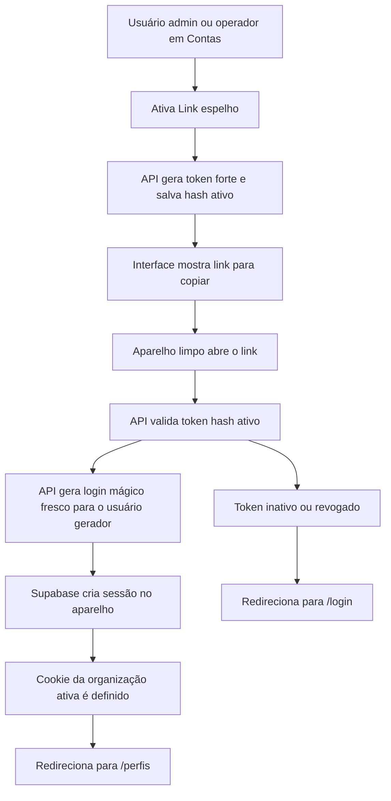

# Plano — Link espelho de login na tela de Contas

## Objetivo

Criar na tela de Contas um controle que, ao ser ativado por um usuário autorizado, gere um link reutilizável enquanto estiver ativo. Ao abrir esse link em um aparelho sem sessão, o Athena deve autenticar o aparelho como o mesmo usuário que ativou o recurso, fixar a organização ativa correta e redirecionar para `/perfis`. Ao desativar o controle, o link ativo deve parar de autenticar e enviar usuários para `/login`.

## Decisão confirmada

- O link autentica exatamente como o usuário que ativou o botão.
- Os aparelhos herdaram as mesmas permissões desse usuário enquanto o link estiver ativo.
- Cada ativação gera um token novo.
- Desativar revoga o token atual.
- Reativar cria outro token e não reaproveita o anterior.

## Arquitetura proposta



## Modelo de dados

Adicionar uma nova migração Supabase, usando o próximo número disponível, para criar uma tabela como `auth_mirror_links`.

Campos sugeridos:

- `id uuid primary key default gen_random_uuid()`
- `organization_id uuid not null references public.organizations(id) on delete cascade`
- `created_by uuid not null references auth.users(id) on delete cascade`
- `created_by_email text not null`
- `token_hash text not null unique`
- `active boolean not null default true`
- `activated_at timestamptz not null default timezone('utc', now())`
- `revoked_at timestamptz`
- `revoked_by uuid references auth.users(id) on delete set null`
- `last_used_at timestamptz`
- `use_count integer not null default 0`
- `created_at timestamptz not null default timezone('utc', now())`
- `updated_at timestamptz not null default timezone('utc', now())`

Índices e regras:

- Índice único parcial para permitir apenas um link ativo por organização: `unique (organization_id) where active = true`.
- Índice em `token_hash` para consumo rápido.
- RLS habilitado.
- `select` apenas para membros da organização.
- `insert`, `update` e revogação apenas para `admin` e `operator`, ou apenas `admin` se quiser endurecer no futuro.
- Nenhum token cru salvo no banco. Guardar apenas SHA-256 do token.

Observação de UX importante: por segurança, o token cru aparece somente no retorno da ativação. Se a página recarregar, a interface mostra que existe link ativo, mas não revela novamente o link antigo. Para copiar de novo, o usuário desativa e ativa novamente, gerando um novo link.

## Endpoints planejados

### `GET /api/auth/mirror-link`

Uso: carregar estado atual na tela de Contas.

Retorno sugerido:

```json
{
  "active": true,
  "activatedAt": "2026-08-12T23:00:00.000Z",
  "createdByEmail": "usuario@exemplo.com",
  "useCount": 10,
  "lastUsedAt": "2026-08-12T23:10:00.000Z"
}
```

Não retorna o token cru.

### `POST /api/auth/mirror-link`

Uso: ativar ou rotacionar o link.

Comportamento:

1. Validar sessão com `getOrganizationContext()`.
2. Exigir organização ativa.
3. Exigir papel `admin` ou `operator`.
4. Revogar qualquer link ativo da organização.
5. Gerar token com `crypto.randomBytes(32).toString('base64url')`.
6. Salvar apenas `sha256(token)`.
7. Retornar `mirrorUrl` construído com `new URL('/auth/espelho/<token>', request.url)`.

### `DELETE /api/auth/mirror-link`

Uso: desativar o link.

Comportamento:

1. Validar sessão e papel.
2. Marcar link ativo da organização como `active = false`, `revoked_at = now()` e `revoked_by = user.id`.
3. Retornar estado inativo.

### `GET /auth/espelho/[token]`

Uso: consumir o link em aparelhos limpos.

Comportamento:

1. Hash do token recebido.
2. Buscar link ativo por `token_hash`.
3. Validar organização não deletada e usuário gerador ainda membro da organização.
4. Gerar uma autenticação fresca para o `created_by_email` via Supabase Admin, preferencialmente `auth.admin.generateLink({ type: 'magiclink', email })`.
5. Verificar o OTP internamente com cliente Supabase SSR usando `verifyOtp({ token_hash, type: 'magiclink' })`, para gravar cookies de sessão no aparelho que acessou o link.
6. Definir cookie `athena-active-organization` com a organização do link.
7. Atualizar `use_count` e `last_used_at`.
8. Redirecionar para `/perfis?mirror=ok`.

Fallback se a persistência de cookies via `verifyOtp` no Route Handler não funcionar no ambiente atual:

- Redirecionar para o `action_link` gerado pelo Supabase com `redirect_to` apontando para `/perfis?mirror=ok`.
- Se necessário, criar uma rota intermediária de callback para trocar a sessão e depois redirecionar para `/perfis`.

## Integração na tela de Contas

Arquivos principais:

- `app/perfis/page.tsx`: carregar estado inicial do link e passar para o cliente.
- `app/perfis/profiles-client.tsx`: adicionar estados, handlers e painel visual.
- `app/globals.css`: adicionar estilos do painel.

Posicionamento recomendado:

- Logo abaixo do bloco `mobile-connect-hint` e mensagens de conexão.
- Antes do painel Zernio.
- Motivo: o recurso é sobre acesso à conta Athena e preparação de aparelhos, então deve ficar visível no topo de Contas, mas separado das ações de sincronizar e conectar Instagram.

Componente visual sugerido:

- Painel compacto com título `Link espelho para aparelhos limpos`.
- Texto curto explicando que ele entra como o usuário atual e cai em `/perfis`.
- Badge de status `Ativo` ou `Inativo`.
- Switch grande à direita para ativar/desativar.
- Quando ativo após geração, mostrar campo somente leitura com link e botão `Copiar link`.
- Mostrar metadados discretos: gerado por, usos, último uso.
- Alerta visual de segurança: `Quem tiver esse link entra como você até ser desativado.`

CSS sugerido:

- Classe base `profile-mirror-login-panel` com `max-width: 1180px`, grid responsivo e mesmo vocabulário visual de `zernio-profile-connect-panel-compact`.
- Fundo em degradê escuro com acento roxo/verde quando ativo.
- Borda verde suave quando ativo e borda roxa/cinza quando inativo.
- Switch com estados claros: trilho escuro no inativo, trilho verde no ativo, bolinha animada.
- Campo de link monoespaçado, com `overflow: hidden`, `text-overflow: ellipsis` e botão de cópia ao lado.
- Em telas pequenas, empilhar conteúdo e controles; botão e input ocupam largura total.

## Fluxo de interface

1. Ao abrir `/perfis`, buscar estado inicial via props ou endpoint.
2. Exibir painel somente para `admin` e `operator`.
3. Ao clicar para ativar:
   - Desabilitar o switch durante a requisição.
   - Chamar `POST /api/auth/mirror-link`.
   - Mostrar o link retornado.
   - Tentar copiar automaticamente para a área de transferência, se permitido pelo navegador.
4. Ao clicar para desativar:
   - Pedir confirmação simples, pois derruba o link atual.
   - Chamar `DELETE /api/auth/mirror-link`.
   - Limpar `mirrorUrl` da tela.
   - Mostrar mensagem de sucesso.
5. Ao usar link revogado:
   - Redirecionar para `/login?mirror=revoked` ou `/login`.
   - Opcionalmente mostrar mensagem na tela de login se o parâmetro existir.

## Segurança e validações

- O token deve ter alta entropia e ser impossível de adivinhar.
- O banco deve armazenar apenas hash do token.
- A ativação deve revogar qualquer link ativo anterior em transação lógica.
- O consumo deve negar links inativos, revogados, sem organização válida ou cujo usuário gerador não pertença mais à organização.
- O link não deve ser exposto para `viewer`.
- O recurso deve deixar claro que qualquer pessoa com o link acessa como o usuário gerador.
- O endpoint de consumo deve usar `no-store` e não cachear respostas.
- O consumo deve atualizar contadores com cliente admin, sem depender de RLS do aparelho ainda sem sessão.
- Considerar rate limit simples por IP no futuro se houver abuso, mas o token forte e revogável resolve o fluxo principal.

## Plano de implementação

- Criar migração Supabase para `auth_mirror_links`, índices, trigger `updated_at`, RLS e grants.
- Criar utilitário server-side para gerar token, calcular hash SHA-256 e montar URL pública.
- Criar endpoints `GET`, `POST` e `DELETE` em `app/api/auth/mirror-link/route.ts`.
- Criar rota de consumo em `app/auth/espelho/[token]/route.ts`.
- Ajustar a criação de sessão Supabase no consumo e garantir escrita dos cookies no redirect.
- Atualizar `app/perfis/page.tsx` para buscar o estado inicial do link ativo.
- Atualizar `app/perfis/profiles-client.tsx` com tipos, estados, handlers e painel.
- Atualizar `app/globals.css` com o CSS do painel, switch, campo do link e responsividade.
- Opcionalmente ajustar `app/login/page.tsx` para exibir mensagem amigável quando `mirror=revoked` ou `mirror=invalid`.
- Validar build TypeScript.

## Checklist de validação

- Usuário `admin` ou `operator` vê o painel e consegue ativar.
- Usuário `viewer` não vê o painel e não consegue chamar os endpoints.
- Ao ativar, aparece um link novo.
- Ao ativar novamente depois de desativar, o link novo é diferente.
- Link ativo aberto em navegador limpo autentica como o usuário gerador e cai em `/perfis`.
- Dez aparelhos usando o mesmo link ativo conseguem criar sessões independentes.
- Ao desativar, o mesmo link deixa de autenticar e redireciona para `/login`.
- O cookie de organização ativa aponta para a organização em que o link foi gerado.
- Se o usuário gerador perder acesso à organização, o link para de funcionar.
- O banco não guarda o token em texto puro.
