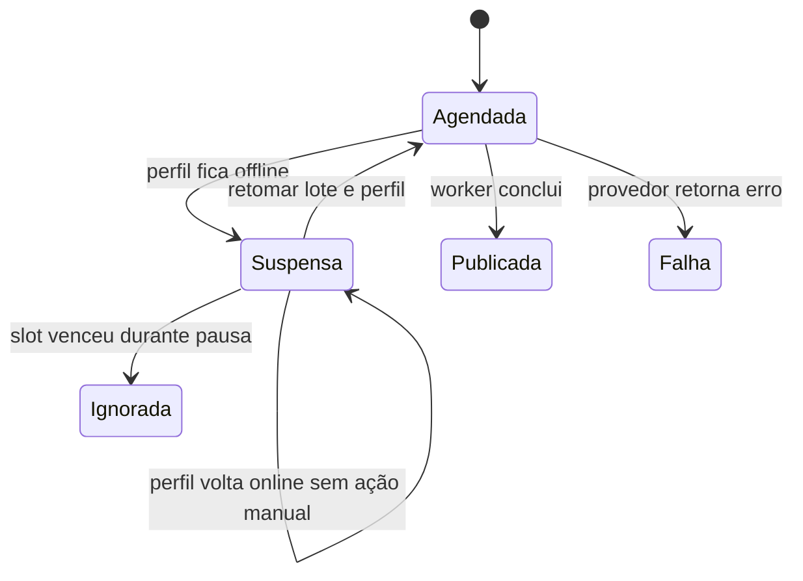

# Plano de execução — Programação em massa de postagens rotativas

## 1. Objetivo e resultado esperado

Criar em `/postagem` um terceiro modo, **Programar em massa**, ao lado de **Agora** e **Programar**. Esse modo terá fluxo próprio, sem cards nem configurações individuais por perfil, e será preparado para selecionar de 300 a 500 perfis online e criar programações rotativas extensas sem expandir todas as publicações no navegador ou na requisição web.

O fluxo final deverá permitir:

- informar um **nome obrigatório para o lote**;
- selecionar muitos perfis em uma coluna compacta à esquerda;
- não mostrar contas `offline` em nenhuma lista de `/postagem`;
- escolher um formato inicial entre Imagem, Reel e Story;
- escolher **uma única origem de mídia** por lote;
- coletar automaticamente todas as mídias elegíveis dessa origem, sem filtros de exibição e sem seleção individual;
- mostrar uma galeria somente de miniaturas, em modo de leitura, sem aparência de cards marcados;
- excluir mídias apagadas, com erro, sem arquivo físico ou incompatíveis com o formato;
- mostrar quantas mídias foram aceitas e quantas foram excluídas por motivo;
- definir um intervalo personalizado em minutos;
- definir por quantos períodos móveis de 24 horas o ciclo será criado;
- aplicar uma única legenda a todas as publicações;
- escolher entre **Mesma ordem em todos os perfis** e **Rotação diversificada por perfil**;
- revisar a projeção antes de confirmar;
- gerar lotes muito grandes de forma assíncrona na VPS, sem limite de negócio arbitrário de 50.000 itens;
- anexar uma nova programação depois do último agendamento já reservado para cada perfil;
- suspender programações de um perfil que ficar offline sem fazer o worker reler esses itens continuamente;
- retomar manualmente um perfil dentro de um lote, descartando os horários perdidos e redistribuindo somente os itens ainda válidos.

---

## 2. Regras funcionais fechadas

### 2.1. Modo de entrada

O seletor **Quando publicar?** passa a ter três opções:

1. **Agora** — preserva o fluxo atual;
2. **Programar** — preserva o compositor atual;
3. **Programar em massa** — abre a nova experiência.

Ao entrar em **Programar em massa**:

- o seletor atual de destino único ou grupo deixa de ser a fonte do plano;
- a nova tela passa a controlar os perfis selecionados;
- os cards de configuração individual do [`GroupComposerNext()`](../app/postagem/group-composer-next.tsx:451) não são renderizados;
- os estados dos modos tradicionais não podem vazar para o novo modo, nem o contrário;
- voltar para **Agora** ou **Programar** restaura o fluxo tradicional sem apagar silenciosamente um rascunho em massa; se houver dados preenchidos, mostrar confirmação antes da troca.

### 2.2. Perfis

- Exibir somente perfis cujo status atual seja `online`.
- Considerar `offline` como conta suspensa.
- Contas `offline` não aparecem no destino tradicional, no seletor de grupo, na lista lateral em massa nem em qualquer outra lista de criação dentro de `/postagem`.
- A exclusão visual não basta: a API e a geração assíncrona devem rejeitar ou suspender perfis que já não estejam online no momento da reserva/materialização.
- A lista lateral não terá configuração individual; terá somente avatar, usuário, nome, checkbox e ações **Selecionar todos** e **Limpar**.
- Selecionar todos deve afetar todos os perfis online elegíveis, inclusive os ainda não renderizados na janela visual.
- Para 300–500 contas, usar lista compacta com rolagem própria e renderização progressiva ou virtualizada, sem criar centenas de cards pesados.

### 2.3. Uma única origem de mídia

- Cada lote aceita exatamente **uma origem**.
- A origem pode ser um grupo de mídias ou a coleção sem grupo, conforme as origens já existentes na biblioteca.
- Trocar a origem substitui integralmente a coleção anterior.
- Não haverá seleção de duas origens; portanto não existe deduplicação entre origens.
- Dentro da origem, cada mídia entra no máximo uma vez, identificada pelo ID único do ativo.
- Não haverá filtros como Disponíveis, Postadas ou Agendadas.
- Mídias já postadas ou já agendadas podem participar, desde que continuem elegíveis; a nova função é explicitamente rotativa e reutilizável.

### 2.4. Elegibilidade das mídias

Uma mídia entra na rotação somente quando todas estas condições forem verdadeiras:

- pertence à organização ativa;
- pertence à origem escolhida;
- não está apagada;
- não tem solicitação de exclusão pendente;
- está com status pronto;
- não possui erro de processamento;
- possui arquivo físico acessível no Storage;
- é compatível com o formato escolhido.

Compatibilidade:

- **Imagem** aceita imagens;
- **Reel** aceita vídeos;
- **Story** aceita imagens e vídeos;
- Carrossel fica fora da primeira versão porque a rotação definida trabalha com uma mídia por slot.

A interface deve informar, separadamente:

- total encontrado na origem;
- total elegível para a rotação;
- excluídas por incompatibilidade de formato;
- excluídas por estado inválido, exclusão ou erro;
- excluídas por ausência de arquivo físico.

Se nenhuma mídia for elegível, bloquear a revisão e o envio.

### 2.5. Intervalo e duração

- O intervalo será um número inteiro de minutos configurável pelo usuário.
- A primeira postagem nova de cada perfil ocorrerá em **base do perfil + intervalo**.
- A duração será informada em dias, mas cada dia representa uma **janela móvel de 24 horas**, conforme regra aprovada; não representa o encerramento às 23:59.
- Quantidade de slots por perfil: parte inteira de `dias × 1.440 ÷ intervalo em minutos`.
- O fim teórico da janela é a base acrescida de `dias × 24 horas`.
- Um slot só entra se estiver dentro dessa janela.
- Exemplo com intervalo de 60 minutos e 3 dias: 72 slots por perfil.
- Exemplo iniciado às 14:37: o primeiro slot é 15:37 e a janela de um dia termina às 14:37 do dia seguinte.
- Exibir horário de São Paulo em toda a revisão, usando a mesma zona oficial já adotada em [`ORGANIZATION_TIME_ZONE`](../lib/publications/composer.ts:78).

Embora não exista limite de quantidade de publicações por lote como regra de negócio, os campos precisam aceitar apenas inteiros positivos representáveis com segurança, e a tela deve apresentar o total projetado antes da confirmação.

### 2.6. Anexação depois da fila existente

Para cada perfil, calcular uma base individual:

1. horário atual;
2. último horário ativo já materializado na fila;
3. último horário reservado por outro plano em massa ainda não totalmente materializado.

A base é o maior desses três valores. A primeira postagem nova será base + intervalo.

Consequências:

- se o perfil não tem fila futura, começa agora + intervalo;
- se já tem 3 dias reservados e recebe mais 3 dias, o novo plano começa depois do último slot e o horizonte passa a equivaler a 6 dias;
- perfis do mesmo lote podem ter datas iniciais e finais diferentes;
- duas confirmações simultâneas não podem reservar o mesmo horizonte para o mesmo perfil.

Essa reserva deve acontecer de forma transacional, com bloqueio por perfil no banco. Ler apenas o último item existente no navegador não é suficiente.

### 2.7. Rotação contínua das mídias

A rotação não reinicia na virada de cada bloco de 24 horas. O índice segue continuamente por todos os slots do perfil.

Exemplo com 20 mídias, intervalo de 60 minutos e 24 slots:

- primeiro bloco: mídias 1 até 20, depois 1, 2, 3 e 4;
- bloco seguinte: começa nas mídias 5, 6, 7 e assim por diante;
- cálculo conceitual: posição da mídia é o índice global do slot módulo a quantidade de mídias.

Cada perfil recebe a coleção completa em rotação. As mídias **não** são repartidas entre os perfis como ocorre hoje em [`distributeMediaBetweenProfiles()`](../lib/publications/composer.ts:201).

### 2.8. Modos de ordem

Usar os nomes de interface:

- **Mesma ordem em todos os perfis**;
- **Rotação diversificada por perfil**.

No primeiro modo, todos os perfis usam a ordem estável da origem.

No segundo modo:

- todos os perfis continuam percorrendo 100% das mídias;
- a ordem deve ser determinística e reproduzível, nunca recalculada aleatoriamente a cada renderização;
- usar uma ordem-base estável e deslocamentos cíclicos distribuídos pelo ordinal do perfil;
- com 40 mídias e 300 perfis, haverá no máximo 40 posições iniciais diferentes e elas serão distribuídas da forma mais equilibrada possível;
- em qualquer perfil, um ciclo completo continua contendo as 40 mídias uma vez cada;
- salvar no plano a versão do algoritmo e uma semente estável para permitir auditoria e retomada sem trocar a sequência.

### 2.9. Nome e legenda

- **Nome do lote** é obrigatório, aparado e limitado a 160 caracteres para ser compatível com a fila atual.
- A legenda é única para todas as postagens e todos os perfis do lote.
- Preservar quebras de linha.
- Limitar a 2.200 caracteres, usando a regra já centralizada em [`MAX_PUBLICATION_CAPTION_LENGTH`](../lib/publications/composer.ts:5).
- Legenda vazia é permitida.

### 2.10. Revisão obrigatória

Antes de criar o plano, abrir uma revisão com:

- nome do lote;
- perfis selecionados e total;
- origem escolhida;
- formato;
- mídias elegíveis e excluídas por motivo;
- intervalo;
- quantidade de janelas de 24 horas;
- slots por perfil;
- total projetado de publicações;
- modo de ordem;
- legenda;
- primeira e última data de uma amostra de perfis;
- aviso de que cada perfil será anexado depois da própria fila existente;
- aviso de processamento assíncrono na VPS.

Não montar uma prévia de cada item. Para 500 perfis, a revisão deve trabalhar com contagens, amostras e fórmulas.

---

## 3. Diagnóstico técnico do estado atual

### 3.1. O compositor atual não deve ser estendido até virar o novo fluxo

[`PublishingClient()`](../app/postagem/publishing-client.tsx:115) mantém destino, modo, nome e itens expandidos no cliente. O modo programado renderiza [`GroupComposerNext()`](../app/postagem/group-composer-next.tsx:451), que mantém planos por perfil e cria os itens finais no navegador por meio de [`makeDraftItems()`](../app/postagem/group-composer-next.tsx:141).

Esse desenho é adequado para composição detalhada, mas não para 500 perfis multiplicados por muitos dias, porque:

- renderiza configuração individual para cada perfil selecionado;
- acumula IDs e datas por postagem no estado React;
- expande o payload antes de chamar a API;
- distribui mídias entre perfis, enquanto a nova regra exige uma rotação completa em cada perfil.

Decisão: criar um componente isolado para a programação em massa e compartilhar apenas utilitários pequenos e puros.

### 3.2. A página atual carrega dados demais para a nova lista

[`PublishingPageContent()`](../app/(painel)/postagem/page.tsx:79) carrega perfis, métricas, grupos e uma página inicial de mídias antes de renderizar. A nova experiência não precisa das métricas detalhadas por perfil e não deve carregar todas as miniaturas antes de a origem ser escolhida.

Decisão: carregar o modo em massa sob demanda por APIs dedicadas, mantendo a entrada tradicional estável.

### 3.3. A API atual possui limites incompatíveis com o requisito

O envio atual em [`POST()`](../app/api/publications/route.ts:272) limita a entrada direta a 5.000 itens e o resultado expandido a 50.000 itens, conforme constantes em [`route.ts`](../app/api/publications/route.ts:11). Acima de 500 itens, a API cria um job assíncrono, mas ainda recebe e armazena todos os itens já expandidos.

O job atual em [`publication_generation_jobs`](../supabase/migrations/059_publication_generation_jobs.sql:5) guarda o payload inteiro em JSON. A materialização atual percorre esse array e grava chunks em [`materialize_publication_generation_job`](../supabase/migrations/060_publication_generation_chunk_processing.sql:12).

Decisão: o modo em massa não utilizará a rota atual com dezenas ou centenas de milhares de itens. Enviará um plano compacto e a VPS fará expansão incremental.

### 3.4. Contadores atuais usam inteiro de 32 bits

Os contadores `expected_items`, `generated_items` e `failed_items` são `integer` em [`publication_generation_jobs`](../supabase/migrations/059_publication_generation_jobs.sql:5). A ausência de limite de negócio exige evitar estouro silencioso.

Decisão: os novos contadores do plano em massa serão `bigint`; respostas JSON deverão serializá-los de modo seguro, preferencialmente como string ou após validação de faixa no servidor.

### 3.5. O worker ainda não impede claim de perfil offline

O claim mais recente em [`claim_publication_items`](../supabase/migrations/037_fix_publication_claim_and_recover_missed_schedules.sql:10) seleciona por status e horário, sem validar o status do perfil. Depois, [`loadWorkItem()`](../scripts/workers/publication-direct-dispatch.mjs:441) carrega o perfil, mas não seleciona nem verifica seu status.

Decisão: a proteção precisa existir no banco antes do claim e novamente no dispatcher antes de qualquer chamada externa.

### 3.6. A recuperação de horários perdidos conflita com a suspensão

O dispatcher executa [`recoverMissedPublicationSchedules()`](../scripts/workers/publication-direct-dispatch.mjs:489) antes do claim, e o próprio claim também chama recuperação. Sem um estado de suspensão excluído desses caminhos, itens de contas offline continuariam sendo varridos e reagendados.

Decisão: itens suspensos devem ficar fora dos índices, claims, retentativas automáticas, recuperação de atrasados e indicadores de atraso operacional.

### 3.7. Rate limits continuam válidos

A fila tem limites conservadores em [`publication_rate_limit_settings`](../supabase/migrations/062_publication_rate_limit_fairness.sql:6), incluindo 100 publicações por perfil em 24 horas e controles por provedor. Programar sem limite não significa publicar sem respeitar o provedor.

Decisão:

- não impor limite arbitrário à quantidade agendada;
- manter guardrails de despacho e limites externos;
- exibir na revisão quando a cadência solicitada pode ser adiada pelo rate limit;
- não prometer que a VPS consegue ultrapassar limites do Instagram ou do provedor.

---

## 4. Arquitetura proposta

### 4.1. Separação entre plano compacto e itens de fila

Criar uma estrutura persistente de planos em massa, em vez de enviar itens expandidos.

Entidades propostas:

#### Plano em massa

Uma tabela de cabeçalho deve guardar:

- organização e autor;
- nome;
- status do plano;
- formato;
- origem única;
- legenda compartilhada;
- intervalo em minutos;
- duração em janelas de 24 horas;
- slots por perfil;
- modo de ordem;
- versão e semente do algoritmo;
- total de perfis;
- total de mídias elegíveis;
- total esperado em `bigint`;
- totais gerado, suspenso, ignorado e com falha;
- datas de criação, início e conclusão;
- ID do lote operacional criado.

#### Perfis do plano

Uma linha por perfil deve guardar:

- plano e perfil;
- ordinal estável;
- status dentro do plano;
- base reservada;
- primeiro e último slot;
- quantidade total de slots;
- próximo índice a materializar;
- deslocamento da rotação;
- motivo e data de suspensão;
- dados da última retomada.

#### Mídias congeladas do plano

Uma linha por mídia deve guardar:

- plano e mídia;
- ordinal estável;
- tipo da mídia;
- estado elegível no momento da confirmação.

O congelamento garante que mudar o grupo de mídia depois da confirmação não altere retroativamente a rotação do lote.

#### Chunks compactos

Cada chunk deve representar uma faixa, e não um array com centenas de objetos completos:

- perfil ou faixa de perfis;
- índice inicial de slot;
- quantidade de slots;
- status, lease e tentativas;
- contagens produzidas, ignoradas e falhas.

### 4.2. Reserva atômica dos horizontes

Criar uma rotina transacional no banco para confirmar o plano:

1. validar organização, papel e campos;
2. resolver novamente os perfis online;
3. resolver novamente as mídias elegíveis da origem;
4. congelar perfis e mídias;
5. para cada perfil, adquirir bloqueio transacional por ID;
6. localizar o maior horário entre agora, itens ativos e reservas de planos pendentes;
7. calcular primeiro slot, último slot e quantidade;
8. gravar a reserva do horizonte;
9. criar o job de geração compacto;
10. retornar contagens e amostras.

Se algum perfil ficar offline entre a revisão e a confirmação, ele não deve ser incluído silenciosamente. A resposta deve informar quantos foram removidos e exigir nova confirmação se o conjunto mudou.

### 4.3. API dedicada

Criar rotas separadas do envio tradicional:

- uma rota para listar perfis online leves;
- uma rota para listar origens;
- uma rota paginada para miniaturas e resumo de elegibilidade da origem;
- uma rota de pré-validação/revisão que não reserva dados;
- uma rota de confirmação que chama a reserva transacional;
- uma rota para consultar progresso do plano;
- uma ação de retomada por lote e perfil.

O corpo da confirmação deve conter somente:

- nome;
- IDs dos perfis;
- tipo e ID da origem única;
- formato;
- intervalo;
- duração;
- legenda;
- modo de ordem;
- token ou versão da revisão para detectar alterações.

Nunca enviar um array com todas as combinações perfil × slot.

### 4.4. Geração incremental na VPS

Evoluir [`publication-generation-worker.mjs`](../scripts/workers/publication-generation-worker.mjs) para reconhecer dois tipos de job:

- geração tradicional com payload de itens;
- geração por plano rotativo compacto.

No tipo rotativo, o worker deve:

1. reivindicar um chunk com lease;
2. carregar apenas perfil, faixa de slots e snapshot de mídias necessários;
3. confirmar que o perfil do plano não está suspenso;
4. calcular cada data por fórmula, sem array global;
5. calcular a mídia pela regra de rotação e deslocamento;
6. inserir itens e vínculos em lote por RPC idempotente;
7. avançar o cursor somente após confirmação do banco;
8. atualizar contadores agregados;
9. repetir até concluir.

As chaves de idempotência devem derivar de plano + perfil + índice global do slot + versão do algoritmo. Reprocessar um chunk não pode duplicar publicações.

### 4.5. Fluxo de dados

```mermaid
flowchart LR
    U[Usuário em Postagem] --> R[Revisão compacta]
    R --> A[API de programação em massa]
    A --> T[Reserva transacional por perfil]
    T --> P[Plano compacto e snapshots]
    P --> G[Worker de geração na VPS]
    G --> C[Chunks idempotentes]
    C --> Q[Itens da fila]
    Q --> W[Worker de publicação]
    W --> I[Instagram ou Zernio]
```

### 4.6. Índices e consultas

Adicionar índices voltados a:

- planos por organização, status e criação;
- perfis de plano por plano e ordinal;
- perfis de plano por perfil e status;
- mídias de plano por plano e ordinal;
- chunks disponíveis por status, lease e ordem;
- itens ativos por perfil e maior data;
- itens suspensos por perfil, lote e data original;
- reservas de horizonte por perfil e último horário.

Evitar consultas com `offset` em tabelas grandes. Usar cursor ou ordinais estáveis.

---

## 5. Suspensão automática e retomada manual

### 5.1. Estado persistente

Adicionar um estado explícito de suspensão à fila, em vez de reutilizar falha ou espera.

O estado suspenso precisa:

- não ser elegível para claim;
- não consumir tentativa;
- não possuir próxima tentativa automática;
- liberar lease e reservas de capacidade quando ainda não houve publicação externa;
- não entrar na recuperação de atrasados;
- não contar como erro;
- aparecer na fila como **Suspensa por perfil offline**;
- manter data originalmente planejada para auditoria.

Adicionar eventos específicos para suspensão, perda por período offline e retomada. O enum atual de eventos foi criado em [`publication_item_event_type`](../supabase/migrations/022_publication_item_events.sql:3) e precisará ser ampliado por migration.

### 5.2. Detecção de mudança para offline

Como o status pode ser alterado por mais de uma integração, centralizar a reação no banco:

- ao mudar de qualquer estado para `offline`, registrar a suspensão do perfil;
- suspender itens futuros elegíveis de todos os lotes desse perfil;
- marcar os perfis correspondentes em planos ainda sendo gerados;
- cancelar ou pausar chunks ainda não iniciados para esses perfis;
- registrar evento e contagens;
- não depender de a tela de perfis estar aberta.

O claim deve fazer uma junção com o perfil e aceitar somente contas online. Essa é a barreira final contra corrida entre mudança de status e worker.

O dispatcher também deve carregar e verificar o status em [`loadWorkItem()`](../scripts/workers/publication-direct-dispatch.mjs:441) antes de preparar contêiner ou chamar provedor.

Itens que já tenham uma publicação externa confirmada não podem ser revertidos. Se uma operação estiver em voo, preservar idempotência e registrar o resultado real.

### 5.3. Retomada manual isolada

Quando o perfil voltar a `online`, nada será retomado automaticamente.

Na fila, cada combinação lote + perfil suspenso terá a ação **Retomar deste ponto**.

A ação afeta somente:

- o lote escolhido;
- o perfil escolhido;
- itens ainda não publicados desse par.

Outros lotes do mesmo perfil continuam suspensos.

### 5.4. Algoritmo de retomada para lote em massa

Em transação:

1. verificar papel, organização e se o perfil está online;
2. bloquear lote, perfil e reserva de horizonte;
3. separar slots cujo horário original já passou;
4. marcar os slots perdidos como ignorados por período offline;
5. contar apenas os slots futuros ainda válidos como restantes;
6. remover ou invalidar reservas antigas desse lote e perfil;
7. obter nova base usando agora, outras filas ativas e outras reservas;
8. redistribuir os itens restantes a partir de nova base + intervalo;
9. manter a posição de rotação correspondente ao próximo item não perdido;
10. recriar chunks não materializados e reagendar itens materializados;
11. registrar evento de retomada com quantidade perdida, mantida e novas datas;
12. devolver o lote e o perfil ao fluxo ativo.

Assim, horários perdidos durante o período offline não geram rajada atrasada e não são republicados. A rotação continua do ponto correto para os itens preservados.

### 5.5. Lotes tradicionais

A barreira de segurança offline deve proteger toda a fila, inclusive itens criados pelo compositor tradicional. Porém, a redistribuição com cadência exata depende do intervalo persistido no plano em massa.

Para lotes tradicionais:

- suspender da mesma forma;
- ignorar itens já vencidos no momento da retomada;
- manter datas futuras ainda válidas, sem inventar uma cadência inexistente;
- oferecer cancelamento dos itens restantes;
- deixar explícito na interface que redistribuição por intervalo é uma capacidade dos lotes em massa.

### 5.6. Fluxo de suspensão

---

## 6. UX e layout da nova tela

### 6.1. Estrutura desktop

Usar melhor a largura da página, com limite maior que os 1.180 pixels atuais de [`publishing-layout`](../app/globals.css:840).

Proposta:

- cabeçalho e seletor de modo em largura total;
- grid principal com coluna lateral de perfis entre 250 e 310 pixels;
- área central fluida para configuração e galeria;
- painel de resumo/revisão compacto e fixável à direita somente em telas muito largas;
- em larguras intermediárias, resumo abaixo da configuração;
- não reutilizar o layout visual dos cards individuais.

### 6.2. Coluna de perfis

- cabeçalho com selecionados sobre disponíveis;
- ações Selecionar todos e Limpar;
- campo de busca por usuário ou nome, sem mudar a seleção global;
- lista compacta com altura útil da viewport;
- checkbox, avatar e usuário;
- nenhum indicador ou configuração de horário por perfil;
- estado vazio quando não houver perfis online.

### 6.3. Configuração global

Agrupar no topo da área central:

- nome do lote;
- formato;
- origem única;
- intervalo em minutos;
- duração em janelas de 24 horas;
- modo de ordem;
- legenda compartilhada.

Exibir imediatamente cartões de cálculo:

- mídias elegíveis;
- slots por perfil;
- perfis selecionados;
- total projetado.

### 6.4. Galeria de miniaturas

- grid denso semelhante à referência visual fornecida;
- cards predominantemente visuais, sem nome longo ocupando espaço;
- proporção consistente e `object-fit: cover`;
- vídeos usam miniatura e um ícone discreto;
- sem checkbox, borda de seleção ou ação de desmarcar;
- estado visual neutro, porque todas as miniaturas exibidas já estão incluídas;
- rolagem interna ou paginação por cursor;
- contador **Exibindo X de Y mídias elegíveis**;
- legenda discreta explicando que todas as elegíveis da origem serão usadas;
- skeleton durante carregamento;
- mensagem separada para excluídas por incompatibilidade ou erro.

As miniaturas são apenas uma prévia paginada. A confirmação no servidor é a fonte de verdade e coleta a origem inteira.

### 6.5. Responsividade

- abaixo do breakpoint de desktop, a coluna de perfis vira um painel recolhível no topo;
- configuração fica em uma coluna;
- galeria mantém duas ou mais colunas quando houver espaço;
- em celular, uma ou duas colunas de miniaturas, sem overflow horizontal;
- botões principais permanecem visíveis e com alvo de toque adequado;
- revisão vira tela ou modal rolável.

### 6.6. Acessibilidade

- modo segmentado com radiogroup;
- rótulos e descrições associados aos campos;
- contadores com atualização não intrusiva;
- foco devolvido corretamente após fechar revisão;
- lista de perfis operável por teclado;
- miniaturas decorativas com texto alternativo útil apenas quando necessário;
- erros agrupados e ligados aos campos;
- não depender somente de cor para elegibilidade, suspensão ou falha.

---

## 7. Fases obrigatórias de implementação

Cada fase deve ser entregue, testada e aprovada antes da seguinte. Não executar todas em uma única alteração.

### Fase 0 — Baseline e proteção contra regressão

Objetivo: congelar o comportamento atual antes de alterar schema ou UI.

- [x] Documentar manualmente Agora, Programar, perfil único e grupo em [`programacao-em-massa-fase-0-baseline.md`](../docs/programacao-em-massa-fase-0-baseline.md).
- [x] Adicionar testes para cálculo recorrente e validação atual em [`composer.test.ts`](../lib/publications/composer.test.ts).
- [x] Registrar amostra de build, testes e estado operacional em [`programacao-em-massa-fase-0-baseline.md`](../docs/programacao-em-massa-fase-0-baseline.md).
- [x] Confirmar qual migration é a última aplicada no ambiente: local e remoto estão alinhados até [`083_queue_reference_dashboard_and_archiving.sql`](../supabase/migrations/083_queue_reference_dashboard_and_archiving.sql).
- [x] Auditar workers e configuração: o runbook registra publicação `direct` e geração `plan` ativas na VPS; o arquivo local de implantação permanece em modo seguro `observe`, recebeu a chave de criptografia validada e foi protegido contra novos commits pelo `.gitignore`.

Critério de saída: fluxo atual coberto e ambiente conhecido. **Concluído em 13/08/2026:** 27 testes aprovados, TypeScript aprovado e build de produção aprovado; nenhum código de produção foi alterado nesta fase.

### Fase 1 — Domínio puro e testes do algoritmo

Objetivo: implementar regras sem banco nem interface.

- [x] Criar tipos do plano compacto em [`bulk-rotation.ts`](../lib/publications/bulk-rotation.ts).
- [x] Implementar cálculo de slots por janela móvel.
- [x] Implementar cálculo da base e do primeiro slot.
- [x] Implementar rotação contínua.
- [x] Implementar mesma ordem e rotação diversificada determinística.
- [x] Implementar projeções em `bigint` sem literais incompatíveis com o alvo ES2017 atual.
- [x] Implementar cálculo de retomada com slots ignorados e restantes.
- [x] Cobrir intervalos que dividem e que não dividem 1.440.
- [x] Cobrir 20 mídias em 24 slots e continuidade no bloco seguinte.
- [x] Cobrir 40 mídias com 300 e 500 perfis.
- [x] Cobrir zero mídia, um perfil, perfil sem fila e perfil com fila existente em [`bulk-rotation.test.ts`](../lib/publications/bulk-rotation.test.ts).

Critério de saída: testes puros provam datas, quantidades e sequências. **Concluído em 13/08/2026:** 40 testes do repositório aprovados, TypeScript aprovado e build de produção aprovado. O build mantém somente os avisos preexistentes de metadata `viewport`/`themeColor`; nenhuma alteração de banco, API, worker, interface ou CSS foi feita nesta fase.

### Fase 2 — Schema do plano e reservas atômicas

Objetivo: persistir planos sem criar ainda a tela final.

- [x] Criar [`084_bulk_rotation_plans_and_atomic_horizons.sql`](../supabase/migrations/084_bulk_rotation_plans_and_atomic_horizons.sql) posterior à migration 083.
- [x] Criar tabelas de plano, perfis, mídias, chunks e reservas de horizonte.
- [x] Usar `bigint` nos contadores do novo fluxo.
- [x] Criar RLS, grants e função transacional idempotente [`create_bulk_rotation_plan()`](../supabase/migrations/084_bulk_rotation_plans_and_atomic_horizons.sql:253).
- [x] Criar índices de claim, progresso, perfil e horizonte.
- [x] Implementar snapshot da origem e perfis online elegíveis.
- [x] Implementar reserva concorrente e monotônica por perfil com advisory lock transacional.
- [x] Documentar teste de duas sessões simultâneas em [`084_bulk_rotation_concurrency.test.sql`](../supabase/tests/084_bulk_rotation_concurrency.test.sql).
- [x] Testar idempotência, fila existente, anexação de horizonte e rollback integral em [`084_bulk_rotation_plans_and_atomic_horizons.test.sql`](../supabase/tests/084_bulk_rotation_plans_and_atomic_horizons.test.sql).

Critério de saída: planos compactos e horizontes são persistidos de forma idempotente. **Concluído em 13/08/2026:** migration aplicada com sucesso sobre um dump descartável do schema remoto em PostgreSQL 17, teste SQL transacional aprovado, `plpgsql_check` sem erros na função principal, dry-run remoto reconhecendo apenas a migration 084, 40 testes da aplicação aprovados, TypeScript aprovado e build de produção aprovado. A migration permaneceu somente local no encerramento desta fase e foi aplicada ao banco remoto no início da Fase 3.

### Fase 3 — APIs de leitura, revisão e confirmação

Objetivo: expor contratos pequenos e seguros.

- [x] Criar listagem leve de perfis online em [`GET()`](../app/api/bulk-publications/profiles/route.ts:8).
- [x] Filtrar offline também no carregamento tradicional de [`PublishingPageContent()`](../app/(painel)/postagem/page.tsx:79).
- [x] Criar listagem de uma origem e resumo de elegibilidade em [`GET()`](../app/api/bulk-publications/origins/route.ts:8) e [`get_bulk_rotation_media_summary()`](../supabase/migrations/085_bulk_rotation_review_queries.sql:4).
- [x] Criar paginação de miniaturas por cursor em [`GET()`](../app/api/bulk-publications/media/route.ts:11).
- [x] Criar revisão compacta com amostras de datas em [`POST()`](../app/api/bulk-publications/review/route.ts:17).
- [x] Criar confirmação idempotente com chave de requisição em [`POST()`](../app/api/bulk-publications/confirm/route.ts:17).
- [x] Detectar mudança entre revisão e confirmação com token HMAC de curta duração e revalidação transacional dos perfis online.
- [x] Retornar contadores grandes sem perda de precisão e progresso agregado em [`GET()`](../app/api/bulk-publications/[planId]/route.ts:9).
- [x] Manter [`POST()`](../app/api/publications/route.ts:272) inalterado para os fluxos tradicionais.

Critério de saída: um cliente de teste consegue revisar e criar um plano sem enviar itens expandidos. **Concluído em 13/08/2026:** contratos compactos, token de revisão, chave idempotente, listagens de perfis/origens, resumo de elegibilidade, miniaturas paginadas, revisão, confirmação e progresso foram implementados; offline foi removido também do fluxo tradicional; [`085_bulk_rotation_review_queries.sql`](../supabase/migrations/085_bulk_rotation_review_queries.sql) foi validada em PostgreSQL 17 com zero erros no `plpgsql_check`, aplicada ao Supabase remoto e o histórico local/remoto ficou alinhado até 085; 46 testes passaram, TypeScript passou e o build de produção passou. A geração incremental permanece deliberadamente para a Fase 4.

### Fase 4 — Geração incremental na VPS

Objetivo: transformar plano em fila com escala e retomada.

- [x] Estender [`publication-generation-worker.mjs`](../scripts/workers/publication-generation-worker.mjs) para jobs compactos.
- [x] Criar claim de chunks por faixa em [`claim_bulk_rotation_generation_chunks()`](../supabase/migrations/086_bulk_rotation_incremental_generation.sql:80).
- [x] Inserir itens em lotes idempotentes em [`process_bulk_rotation_generation_chunk()`](../supabase/migrations/086_bulk_rotation_incremental_generation.sql:191).
- [x] Persistir cursores e contadores após cada passo limitado.
- [x] Pausar perfil de plano sem bloquear os outros perfis.
- [x] Retomar leases expirados sem duplicação.
- [x] Não carregar o plano inteiro em memória.
- [x] Adicionar heartbeat com plano, chunk, resultado do ciclo e backlog agregado.
- [x] Testar interrupção/lease expirado no meio de um chunk.
- [x] Testar reprocessamento do mesmo chunk.

Critério de saída: plano sintético grande é materializado integralmente e sem duplicatas. **Concluído em 13/08/2026:** a migration [`086_bulk_rotation_incremental_generation.sql`](../supabase/migrations/086_bulk_rotation_incremental_generation.sql) implementou claims compactos, leases recuperáveis, passos de até 1.000 slots, cursores transacionais, replay idempotente, falhas consecutivas, exaustão de retries, proteção de horizonte/mídia e suspensão offline sem retry; o worker passou a processar chunks compactos com memória limitada e isolamento de falhas; o teste SQL funcional passou sobre uma restauração limpa do schema remoto em PostgreSQL 17; `plpgsql_check` retornou zero erros; a migration foi aplicada ao Supabase remoto e o histórico ficou alinhado até 086; 46 testes da aplicação e 5 testes do worker passaram, TypeScript e build de produção passaram; smokes remotos em `observe` e `plan` sem backlog confirmaram os novos contratos. A suspensão/retomada operacional completa da fila permanece para as Fases 5 e 6.

### Fase 5 — Suspensão offline no banco e no worker

Objetivo: impedir custo repetitivo e publicação indevida.

- [x] Adicionar estado e eventos de suspensão.
- [x] Criar reação central à transição para offline.
- [x] Suspender itens e perfis de planos ainda em geração.
- [x] Excluir suspensos de claims, recuperação, retries e indicadores de atraso.
- [x] Exigir perfil online no claim.
- [x] Verificar perfil novamente em [`loadWorkItem()`](../scripts/workers/publication-direct-dispatch.mjs:441).
- [x] Tratar com segurança item já em voo.
- [x] Atualizar resumos e tipos da fila em [`publication-queue-types.ts`](../app/queue/publication-queue-types.ts).
- [x] Testar conta offline com milhares de itens para garantir que o worker não os varre.

Critério de saída: nenhum item suspenso é reivindicado ou recuperado automaticamente. **Concluído em 13/08/2026:** as migrations [`087_add_publication_suspension_states.sql`](../supabase/migrations/087_add_publication_suspension_states.sql) e [`088_suspend_offline_profile_publications.sql`](../supabase/migrations/088_suspend_offline_profile_publications.sql) adicionaram suspensão transacional, auditoria, barreira online imediatamente antes do provedor e reconciliação de confirmação/criação já aceita; itens suspensos não entram em claim, retry, recuperação ou atraso e voltar o perfil para online não os retoma. O teste SQL base e o teste de escala com 2.000 itens passaram em PostgreSQL 17; `plpgsql_check` não encontrou erros; 10 testes dos workers e 46 testes da aplicação passaram; TypeScript e build de produção passaram. O histórico local/remoto ficou alinhado até 088, as RPCs foram confirmadas no PostgREST e o dispatcher atualizado foi implantado na VPS com backup, validação de sintaxe, restart no PM2, heartbeat ativo, ciclos limpos e nenhum novo registro no log de erro durante a observação pós-restart. A retomada continua deliberadamente ausente e reservada à Fase 6.

### Fase 6 — Retomada manual por lote e perfil

Objetivo: continuar sem rajada de atrasados.

- [x] Criar RPC transacional de retomada.
- [x] Ignorar horários vencidos durante a pausa.
- [x] Redistribuir itens restantes de lotes em massa a partir de agora + intervalo.
- [x] Preservar sequência de rotação.
- [x] Recalcular horizonte sem conflito com outros lotes.
- [x] Manter outros lotes do perfil suspensos.
- [x] Criar endpoint autorizado.
- [x] Registrar auditoria completa.
- [x] Expor ação no agrupamento lote + perfil da fila.
- [x] Testar offline, online sem play e online com play.

Critério de saída: retomada afeta somente o par escolhido e não publica itens perdidos. **Concluído em 13/08/2026:** as migrations [`089_add_publication_resume_event.sql`](../supabase/migrations/089_add_publication_resume_event.sql) e [`090_resume_suspended_batch_profile_publications.sql`](../supabase/migrations/090_resume_suspended_batch_profile_publications.sql) adicionaram evento explícito, auditoria agregada e a RPC transacional [`resume_suspended_batch_profile_publications()`](../supabase/migrations/090_resume_suspended_batch_profile_publications.sql:44). A operação exige perfil online, serializa por perfil, trata somente o par lote/perfil selecionado, encerra slots vencidos, calcula uma nova base segura contra fila e horizontes concorrentes, redistribui o restante e preserva os índices originais da rotação compacta. O endpoint autorizado e a ação na fila foram adicionados; nenhum outro lote é retomado. Testes SQL cobriram offline, online sem ação, retomada tradicional isolada, segundo play rejeitado e retomada compacta parcial com continuidade da rotação. As migrations passaram sobre restauração limpa do schema remoto em PostgreSQL 17, foram aplicadas ao Supabase remoto e o histórico ficou alinhado até 090; a RPC foi confirmada no cache do PostgREST; 46 testes da aplicação, TypeScript e build de produção passaram.

### Fase 7 — Estrutura da nova interface

Objetivo: montar o fluxo funcional sem polimento final.

- [x] Adicionar **Programar em massa** no seletor de [`PublishingClient()`](../app/postagem/publishing-client.tsx:116).
- [x] Criar componente próprio para o modo em massa.
- [x] Implementar lista lateral de perfis sem cards individuais.
- [x] Implementar nome obrigatório, formato, origem, intervalo, duração, ordem e legenda.
- [x] Implementar contadores projetados.
- [x] Implementar galeria paginada somente de miniaturas.
- [x] Implementar revisão compacta.
- [x] Implementar confirmação e acompanhamento do job.
- [x] Preservar rascunho ao alternar modo com confirmação.

Critério de saída: o fluxo completo funciona em desktop com dados reais. **Concluído em 13/08/2026:** [`PublishingClient()`](../app/postagem/publishing-client.tsx:116) passou a oferecer o terceiro modo no seletor principal sem exigir um destino tradicional prévio e preserva os rascunhos dos dois fluxos ao alternar, com confirmação quando há conteúdo. O componente dedicado [`BulkPublishingClient()`](../app/postagem/bulk-publishing-client.tsx:146) carrega somente perfis online e origens compactas, permite seleção lateral, configura nome obrigatório, formato, origem única, intervalo, duração, ordem e legenda compartilhada, calcula projeções com `BigInt`, apresenta elegibilidade por motivo e miniaturas paginadas somente para leitura, revisa com token temporário, confirma com chave idempotente e acompanha o plano por polling sem expandir publicações no React. O CSS funcional ficou isolado em [`bulk-publishing.module.css`](../app/postagem/bulk-publishing.module.css), deixando virtualização, medições de 300–500 perfis e acabamento visual final para as Fases 8 e 9. TypeScript, os 46 testes da aplicação e o build de produção passaram; permaneceram apenas os avisos de metadata do Next.js já existentes em login/onboarding.

### Fase 8 — Escala da interface e acessibilidade

Objetivo: validar 300–500 perfis sem travar o navegador.

- [x] Implementar renderização progressiva ou virtualização da lista lateral.
- [x] Garantir Selecionar todos sobre perfis não renderizados.
- [x] Evitar recomputar arrays perfil × slot no React.
- [x] Cancelar requisições antigas ao trocar origem ou formato.
- [x] Testar navegação por teclado e foco da revisão.
- [x] Testar estados vazio, carregando, erro e alteração concorrente.
- [x] Medir quantidade de nós no DOM e tempo de interação.

Critério de saída: seleção de 500 perfis e navegação da galeria permanecem responsivas. **Concluído em 13/08/2026:** a lista lateral de [`BulkPublishingClient()`](../app/postagem/bulk-publishing-client.tsx:155) passou a renderizar inicialmente 80 perfis e revelar novos blocos no scroll ou por ação explícita, mantendo no estado lógico todos os perfis filtrados e permitindo selecionar os 500 mesmo quando apenas parte deles está no DOM. Os cálculos puros de limite, seleção e projeção `BigInt` foram extraídos para [`bulk-ui.ts`](../lib/publications/bulk-ui.ts) e cobertos por cinco testes em [`bulk-ui.test.ts`](../lib/publications/bulk-ui.test.ts), incluindo 500 perfis e projeção numérica muito acima do limite seguro de `number`. Requisições de setup, mídia, paginação e polling agora usam `AbortController`; respostas antigas de origem/formato são descartadas por sequência e identidade, e o polling é sequencial para não acumular chamadas. A revisão recebe foco inicial, fecha com Escape, mantém Tab dentro do diálogo e devolve foco ao acionador. A própria interface informa quantos perfis estão no DOM, permitindo confirmar o teto inicial de 80 nós de perfil para uma seleção lógica de 500. TypeScript, 51 testes e o build de produção passaram; somente os avisos preexistentes de metadata e módulo do Node permaneceram.

### Fase 9 — Revisão final de CSS

Objetivo: fazer o acabamento somente depois das regras estarem estáveis.

- [x] Criar CSS Module dedicado ao modo em massa.
- [x] Aumentar a largura útil somente nesse modo.
- [x] Revisar grid desktop, telas intermediárias e celular.
- [x] Revisar alturas, rolagens internas e elementos fixos.
- [x] Padronizar estados hover, focus, disabled, loading e erro.
- [x] Remover estilos duplicados ou regras globais desnecessárias.
- [x] Verificar contraste e truncamento de usuários longos.
- [x] Verificar miniaturas verticais, horizontais, ausentes e de vídeo.
- [x] Fazer inspeção visual em 360, 768, 1.024, 1.440 e telas ultrawide.

Critério de saída: interface utiliza bem o espaço, sem CSS improvisado ou overflow. **Concluído em 13/08/2026:** o modo em massa passou a usar largura própria de até 1.440 px, mantendo o compositor tradicional em 1.180 px. O módulo [`bulk-publishing.module.css`](../app/postagem/bulk-publishing.module.css) foi consolidado com grid desktop de coluna lateral entre 270–350 px, ajustes específicos para 1.100, 820, 620 e 400 px, comportamento ultrawide acima de 1.600 px, painel lateral fixo somente quando há espaço, rolagem interna com `overscroll-behavior`, ação de revisão fixa em desktop e estática em telas menores. Estados hover, `focus-visible`, disabled, loading, vazio, modal e `prefers-reduced-motion` foram padronizados. Nomes longos permanecem truncados; métricas usam `min-width: 0`; miniaturas verticais e horizontais usam `object-fit: contain`, fundo neutro e fallback textual para mídia ausente ou vídeo. A inspeção estática dos pontos 360, 768, 1.024, 1.440 e ultrawide não encontrou regra com largura fixa capaz de causar overflow. TypeScript, 51 testes e build de produção passaram; permaneceram somente os avisos preexistentes de metadata e módulo do Node.

### Fase 10 — Carga, observabilidade e implantação gradual

Objetivo: provar operação antes de liberar volume total.

- [x] Criar seed e limpeza para planos sintéticos.
- [ ] Testar 300 perfis × 24 slots.
- [ ] Testar 500 perfis × 24 slots.
- [ ] Testar múltiplos dias e origem com 40 mídias.
- [ ] Testar suspensão de parte dos perfis durante geração e publicação.
- [ ] Testar reinício dos dois workers.
- [ ] Medir taxa de geração, tamanho das tabelas, tempo de claim e backlog.
- [x] Criar alertas para plano parado, chunk com lease expirado e crescimento anormal.
- [x] Implantar por flag de recurso para administradores.
- [ ] Liberar primeiro com lote controlado e ampliar somente após validação.
- [x] Documentar rollback que pausa geração sem apagar itens já materializados.

Critério de saída: operação comprovada, observável e reversível. **Base técnica concluída em 13/08/2026 e pós-deploy validado em 14/08/2026:** os cenários compactos autenticados em [`bulk-rotation-scale-scenarios.mjs`](../scripts/load-test/bulk-rotation-scale-scenarios.mjs) criam planos 300×24, 500×24 ou 500×72 sem falsificar `auth.uid()`, exigem staging, guardrail explícito, JWT curto de admin/operator e exatamente 40 mídias elegíveis. A limpeza em [`cleanup-bulk-rotation-data.mjs`](../scripts/load-test/cleanup-bulk-rotation-data.mjs) respeita a FK restritiva, removendo plano e cascatas antes do lote. A migration [`091_bulk_rotation_operational_observability.sql`](../supabase/migrations/091_bulk_rotation_operational_observability.sql) agrega backlog, chunks, leases e contagem de linhas, produz quatro alertas operacionais e limita a consulta a admin/service role; o teste transacional [`091_bulk_rotation_operational_observability.test.sql`](../supabase/tests/091_bulk_rotation_operational_observability.test.sql) passou em PostgreSQL 17 limpo. A flag `BULK_PUBLICATION_ROLLOUT` agora controla interface, review e confirmação no servidor, e `PUBLICATION_GENERATION_WORKER_BULK_ENABLED=false` interrompe novos claims compactos sem apagar estado. Scripts, TypeScript, 51 testes da aplicação, 6 testes do generation worker e build passaram. Após o deploy da Vercel, a migration 091 foi aplicada ao Supabase remoto, o relatório global respondeu em 372 ms sem alertas e com backlog vazio, `/postagem` redirecionou corretamente usuário anônimo para login e a API de review respondeu 401 sem sessão. O runbook documenta suspensão parcial, reinício isolado dos workers, coleta de métricas, rollout e rollback. Os três degraus reais, a suspensão durante carga e os reinícios permanecem deliberadamente pendentes até execução em staging controlado; nenhuma carga foi disparada contra produção nesta validação.

---

## 8. Matriz mínima de testes e aceite

### Cálculo e rotação

- [ ] Intervalo 60, 1 dia: 24 slots por perfil.
- [ ] Intervalo 60, 3 dias: 72 slots por perfil.
- [ ] Intervalo 90, 1 dia: 16 slots por perfil.
- [ ] Intervalo que não divide 1.440 não cria slot fora da janela.
- [ ] Primeira postagem é base + intervalo, nunca no instante da confirmação.
- [ ] Com 20 mídias e 24 slots, os quatro últimos repetem 1–4.
- [ ] O slot seguinte continua na mídia 5.
- [ ] Rotação diversificada preserva todas as mídias em cada perfil.
- [ ] Reexecutar cálculo com a mesma semente produz a mesma sequência.

### Anexação

- [ ] Perfil vazio começa agora + intervalo.
- [ ] Perfil com 3 dias recebe os próximos 3 dias depois do último slot.
- [ ] Dois perfis com horizontes diferentes recebem bases diferentes.
- [ ] Duas confirmações simultâneas não sobrepõem horários.
- [ ] Plano ainda não materializado já bloqueia o horizonte reservado.

### Mídias

- [ ] Uma única origem pode ser selecionada.
- [ ] Trocar origem substitui a galeria.
- [ ] Reel exclui imagens e informa a quantidade.
- [ ] Imagem exclui vídeos e informa a quantidade.
- [ ] Story aceita os dois tipos.
- [ ] Apagada, com erro, pendente de exclusão e sem Storage ficam fora.
- [ ] Mídia já postada continua elegível.
- [ ] Alterar o grupo depois da confirmação não altera o snapshot.

### Perfis

- [ ] Offline não aparece em nenhuma lista de criação de `/postagem`.
- [ ] Selecionar todos inclui todos os online, não apenas os visíveis.
- [ ] Perfil que fica offline entre revisão e confirmação não é reservado.
- [ ] Perfil que fica offline durante geração pausa apenas sua parte.
- [ ] API rejeita ID offline enviado manualmente.

### Suspensão e retomada

- [ ] Transição para offline suspende todos os itens elegíveis do perfil.
- [ ] Suspensos não são reivindicados por múltiplos ciclos do worker.
- [ ] Voltar a online não retoma automaticamente.
- [ ] Play em um lote não retoma outro lote.
- [ ] Horários vencidos são ignorados.
- [ ] Restantes começam na nova base + intervalo.
- [ ] Sequência de mídia continua corretamente.
- [ ] Item em voo não é duplicado.

### Escala

- [ ] Navegador não cria um item React por publicação projetada.
- [ ] API não recebe combinações perfil × slot.
- [ ] Worker processa por chunks com memória limitada.
- [ ] Queda após commit e antes do ack não duplica itens.
- [ ] Contadores suportam valores acima de 50.000.
- [ ] Resumo e fila não carregam todos os itens para calcular progresso.

### Regressão

- [ ] Agora continua funcionando.
- [ ] Programar tradicional continua funcionando.
- [ ] Perfil único e grupo continuam funcionando.
- [ ] Cancelamento e retry atuais continuam funcionando.
- [ ] Geração tradicional acima de 500 itens continua funcionando.

---

## 9. Riscos principais e mitigação

### Explosão de volume

Risco: 500 perfis com intervalo de 60 minutos produzem 12.000 publicações por janela de 24 horas. Muitos dias podem gerar milhões de linhas.

Mitigação: plano compacto, geração incremental, `bigint`, índices específicos, revisão do total, telemetria, chunks e implantação gradual. Não estabelecer teto de negócio oculto, mas mostrar impacto operacional com clareza.

### Limites externos confundidos com capacidade da VPS

Risco: a VPS gerar rapidamente não significa que o Instagram aceitará qualquer frequência.

Mitigação: manter [`reserve_publication_dispatch_capacity`](../supabase/migrations/062_publication_rate_limit_fairness.sql:102), informar possíveis adiamentos e tratar rate limit como estado operacional, não como falha do plano.

### Sobreposição entre planos simultâneos

Risco: dois lotes lerem o mesmo último horário e criarem slots iguais.

Mitigação: bloqueio transacional por perfil e tabela de reserva de horizonte que considera planos ainda não materializados.

### Mudança da origem durante geração

Risco: a rotação mudar no meio do lote.

Mitigação: snapshot normalizado das mídias no momento da confirmação.

### Conta offline continuar pesando no worker

Risco: itens em espera ou vencidos serem relidos a cada poll.

Mitigação: estado suspenso fora dos índices de claim e recuperação, pausa dos chunks e dupla verificação banco + dispatcher.

### Retomada causar rajada de atrasados

Risco: devolver itens vencidos para waiting.

Mitigação: marcar perdidos como ignorados e recalcular apenas os restantes a partir de uma nova base.

### CSS ser implementado antes da estrutura estabilizar

Risco: retrabalho, regras globais conflitantes e layout quebrado.

Mitigação: acabamento visual é uma fase própria depois do fluxo funcional e dos testes de escala.

---

## 10. Fora do escopo inicial

- múltiplas origens no mesmo lote;
- escolha ou desmarcação individual de mídia dentro da origem;
- legenda diferente por perfil ou por mídia;
- formato automático misturando Imagem e Reel;
- carrossel rotativo;
- horários fixos por perfil;
- retomada automática ao perfil voltar online;
- alteração da mídia ou legenda de um lote já confirmado;
- promessa de ignorar limites oficiais do provedor.

---

## 11. Ordem de aprovação recomendada

Para evitar uma entrega parcial com regra ou CSS quebrado, aprovar e executar nesta ordem:

1. regras e testes puros;
2. schema e reserva atômica;
3. APIs compactas;
4. geração incremental;
5. suspensão offline;
6. retomada manual;
7. interface funcional;
8. escala e acessibilidade;
9. revisão final de CSS;
10. carga e rollout.

Nenhuma fase deve ser considerada concluída apenas porque compila. Cada uma precisa cumprir o próprio critério de saída e os testes relacionados antes da próxima.
