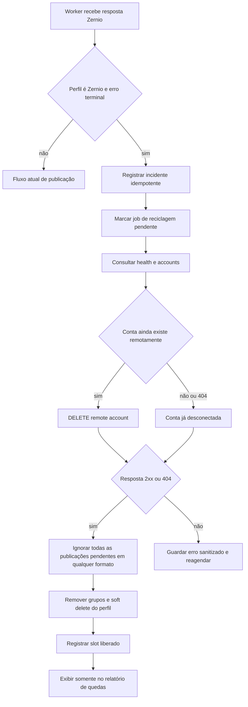

# Plano: reciclagem automática de contas Zernio desconectadas

## Decisões confirmadas

- O escopo inicial é exclusivo para perfis cujo provedor é `zernio`.
- Os únicos gatilhos automáticos iniciais são os erros `ACCOUNT_DISCONNECTED` e `auth_expired`, independentemente de maiúsculas/minúsculas e tanto no código estruturado quanto na mensagem retornada pela Zernio.
- Esses sinais significam queda terminal para a operação: o perfil não será reconectado nem retomado.
- A automação deve remover o social account remoto na Zernio e fazer exclusão lógica definitiva do perfil no Atena; uma nova conexão será sempre um novo processo.
- A resposta `404` da Zernio significa, por decisão aprovada, que o social account já está desconectado. Ela é um sucesso idempotente da reciclagem, autoriza ignorar todos os itens pendentes, fazer a exclusão lógica local e liberar o slot da conexão, sem depender de nova confirmação remota.
- Todas as publicações pendentes daquele perfil, em qualquer formato, devem ser encerradas como `ignored`, e não permanecer como erro, tentativa ou suspensão.
- O registro do incidente permanece para auditoria mesmo após a remoção do perfil. A lista de quedas fica separada dos erros gerais em `/operacao`; incidentes de queda não permanecem em problemas críticos, atenção ou fila operacional.
- Quedas classificadas não incrementam limites de tentativa, rate limits, métricas de falha, nem acionam ou alimentam circuit breakers. A exclusão remota confirmada por `2xx` ou a desconexão já existente identificada por `404` liberam o slot da conexão Zernio para o fluxo de cadastro existente.
- Não haverá alerta agregado nem escalonamento operacional para `404`: cada resposta `404` bem-sucedida ficará, individualmente, no relatório/log de remoções bem-sucedidas, marcada com o tipo `already_disconnected_404`, para observação humana caso o volume se torne incomum.

## Evidência recebida

As capturas apresentam os dois sinais de queda em Reels vinculados à Zernio:

| Perfil exibido | Sinal recebido |
| --- | --- |
| `@marinhojoilma476` | `ACCOUNT_DISCONNECTED` |
| `@ketlen.salgueiro170` | `ACCOUNT_DISCONNECTED` e `auth_expired` |
| `@christiane.mesquita195` | `auth_expired` |
| `@grazielacutrim88` | `ACCOUNT_DISCONNECTED` e `auth_expired` |
| `@_genildapassos533` | `auth_expired` |
| `@andradeester583` | `ACCOUNT_DISCONNECTED` e `auth_expired` |

O backfill deve localizar os IDs reais por `username`, `provider = zernio` e histórico recente de falha. Ele não pode inferir o `zernio_account_id` a partir do texto da captura.

## Capacidades Zernio já encontradas no projeto

O cliente existente em [`lib/integrations/zernio-client.ts`](../lib/integrations/zernio-client.ts) já modela estes endpoints:

| Objetivo | Método e rota | Uso na reciclagem |
| --- | --- | --- |
| Listar contas conectadas | `GET /v1/accounts` | Confirmar a presença e obter o snapshot mínimo do social account. |
| Verificar saúde | `GET /v1/accounts/health` | Validar se o account ainda aparece e registrar estado/capacidade antes da remoção. |
| Desconectar social account | `DELETE /v1/accounts/:accountId` | Remover a conexão Zernio e liberar o slot remoto. |

O método [`disconnectAccount()`](../lib/integrations/zernio-client.ts:355) já é empregado pela rota manual [`DELETE()`](../app/api/integrations/meta/profiles/[profileId]/route.ts:8). A implementação automática deve reutilizar esse cliente, sem expor API key ao navegador e sem chamar a Zernio pela interface.

## Validação obrigatória do contrato da Zernio

Antes de ativar a automação, executar somente com a chave da conexão identificada no próprio perfil e registrar um diagnóstico sanitizado:

1. Chamar `GET /v1/accounts/health` e `GET /v1/accounts` para um dos perfis em queda, sem mutação.
2. Confirmar o campo canônico de ID remoto, como `_id`, `id` ou `accountId`, e se o registro ainda aparece como conectado ou inativo.
3. Consultar a documentação da Zernio para confirmar autenticação, o contrato de `DELETE /v1/accounts/:accountId` e a representação técnica da resposta, sem alterar a decisão de produto já aprovada: `404` significa conta já desconectada e finaliza a reciclagem.
4. Planejar uma exclusão controlada apenas para a etapa de validação pós-implementação, usando uma conta incidentada e o identificador já persistido no incidente; repetir health/listagem para demonstrar que o slot foi liberado. Este plano não executa essa chamada nem qualquer outra chamada real à Zernio.
5. Considerar `2xx` como remoção remota concluída e `404` como conta já desconectada/removida, ambos aptos à limpeza local final. `401`, `403`, `429` e `5xx` não removem localmente: mantêm o incidente pendente para retry seguro.

O ambiente desta sessão não expõe ferramenta de navegador ou terminal para consultar [`https://docs.zernio.com/`](https://docs.zernio.com/) nem executar a chave local. Portanto, estes passos continuam como gate explícito de implementação, não como fato já validado.

## Fluxo transacional proposto

### Ordem de consistência

1. O worker classifica o erro por função pura e cria, na mesma transação, um incidente único por perfil e um job de reciclagem. Ele encerra somente o item que detectou a queda como `ignored` com motivo `zernio_account_disconnected`; não faz retry de publicação, não consome tentativa e não altera rate limit, métricas de falha ou circuit breaker.
2. Um processador dedicado busca jobs com lock/lease. Ele usa o `zernio_connection_id` do snapshot do incidente para garantir que cada conta seja removida usando a mesma API key que a conectou.
3. O processador obtém snapshot sanitizado por health/listagem e chama a exclusão remota. Chaves, tokens, URL de mídia, legenda e payloads não entram no banco nem nos logs.
4. Após `2xx` ou `404`, um RPC executa atomicamente a limpeza local. Para `404`, a causa persistida é `already_disconnected`; ainda assim, a transação ignora todos os itens não publicados de todos os formatos, libera reservations, interrompe chunks e planos pendentes, remove vínculos de grupo e preenche `deleted_at` do perfil.
5. O RPC registra um evento por item ignorado e um evento/ledger de incidente com as contagens. Quando a finalização ocorrer por `404`, o ledger deve registrar o resultado de sucesso `already_disconnected_404`, e o relatório de remoções bem-sucedidas deve exibi-lo como `conta já desconectada — removida localmente`. Esses eventos são excluídos das consultas de limites, tentativas, circuit breakers, problemas críticos, atenção e fila. A interface deixa de mostrar a conta entre perfis ativos e o contador de slots livres passa a refletir a redução em `instagram_profile_count` da conexão.
6. Uma falha transitória da Zernio nunca pode apagar o perfil local. O job fica em `remote_removal_pending` com retry exponencial e alerta operacional. Duplicatas e reinícios retornam o mesmo incidente e não fazem uma segunda exclusão.
7. Jobs de organizações distintas não compartilham incidente, lock, lease, perfil, conexão ou transação. Cada claim deve ser condicionado ao `organization_id` e ao ID do job, enquanto a finalização bloqueia somente o perfil e suas pendências. Assim, uma onda de quedas de uma organização não bloqueia, altera ou encerra publicações da outra; se o worker parar após qualquer etapa, o lease expira e a retomada reabre o mesmo job idempotente, sem repetir a remoção remota nem interromper a limpeza local já concluída.

## Persistência a criar

Criar migration posterior à [`100_zernio_recovery_and_failure_acknowledgements.sql`](../supabase/migrations/100_zernio_recovery_and_failure_acknowledgements.sql) com:

1. Tabela `zernio_profile_disconnection_incidents` com `organization_id`, `profile_id`, `zernio_connection_id`, `zernio_account_id`, username e label da conexão como snapshots, sinal normalizado, código/mensagem sanitizados, item e batch de origem, `detected_at`, estado e dados de remoção remota.
2. Restrição única para incidente ativo por perfil e referência preservada mesmo quando `instagram_profiles.deleted_at` for preenchido. O snapshot deve bastar para a tela continuar mostrando o perfil removido.
3. Tabela ou campos de job de reciclagem com lease, tentativas, próximo retry, request ID, resultado HTTP sanitizado e horários de health/listagem/exclusão. O resultado deve distinguir `remote_deleted` de `already_disconnected_404`, sendo ambos estados terminais de sucesso e aptos a liberar slot.
4. RPC `finalize_zernio_profile_recycling` com validação de service role e do job em estado `remote_deleted` ou `already_disconnected_404`. Ele deve converter itens pendentes `waiting`, `ready`, `preparing`, `publishing`, `failed` e `suspended` em `ignored`, independentemente do formato de publicação, mas nunca tocar em itens já `published`, `removed`, `cancelled` ou `ignored`.
5. Atualização explícita dos planos compactos, chunks, reservas diárias, reservas de dispatch e status de lotes para que não exista nova geração ou claim do perfil removido.
6. Consultas e índices por organização, estado, detecção e conexão para alimentar a página sem varrer os eventos comuns. As consultas que abastecem limites, tentativas, circuit breakers, problemas críticos, atenção e fila devem excluir explicitamente incidentes e eventos com `zernio_account_disconnected`.
7. Claim do job com `FOR UPDATE SKIP LOCKED` ou mecanismo equivalente, chave única do incidente incluindo `organization_id` e `profile_id`, e idempotency key por tentativa remota. A rotina de finalização deve validar o `organization_id` em todas as relações e ser uma única transação: ou conclui toda a limpeza daquele perfil, ou não persiste limpeza parcial; após interrupção, um novo worker continua com o mesmo incidente.

## Alterações no worker

1. Extrair de [`statusResult()`](../scripts/workers/publication-direct-dispatch.mjs:472) um classificador `isZernioTerminalAccountDisconnection`, aceitando apenas `ACCOUNT_DISCONNECTED` e `auth_expired` normalizados. Mensagens parecidas não acionam exclusão sem um código/sinal permitido.
2. No ramo de falha de [`processClaimedItem()`](../scripts/workers/publication-direct-dispatch.mjs:876), antes de [`complete_publication_item()`](../scripts/workers/publication-direct-dispatch.mjs:955), agendar o incidente. A chamada deve carregar perfil, conexão e account ID já presentes no work item.
3. Trocar o item atual para `ignored` por RPC dedicado, com evento contendo o ID do incidente, em vez de deixá-lo `failed` ou submetê-lo às cinco tentativas; a transição é neutra para limites, contadores de tentativas e circuit breakers.
4. Adicionar ciclo de job de reciclagem ao worker existente ou um worker separado. A preferência é processo separado para que lentidão e rate limit da Zernio não diminuam a vazão de publicações.
5. Reutilizar [`createZernioClientForConnection()`](../lib/integrations/zernio-client.ts:382) e [`disconnectAccount()`](../lib/integrations/zernio-client.ts:355); não duplicar criptografia, seleção de chave ou tratamento de HTTP.
6. Classificar `404` incondicionalmente como sucesso idempotente `already_disconnected_404`: seguir para a finalização local, ignorar todos os pendentes de qualquer formato e liberar o slot. Outros erros preservam o perfil e atualizam apenas o job/ledger.

## Interface exclusiva em `/operacao`

1. Adicionar um painel ou rota filha, como `/operacao/quedas-zernio`, carregado de `zernio_profile_disconnection_incidents`, não de `publication_item_events`. Este é o relatório/página definitivo de quedas, inclusive dos incidentes cuja exclusão retornou `404`.
2. Mostrar username, conexão Zernio usada, conta Zernio, sinal detectado, item/lote de origem, momento, estado de remoção remota, tentativas, itens ignorados, planos interrompidos e confirmação de slot liberado. A aba/filtro de remoções bem-sucedidas deve incluir cada incidente `404`, marcado explicitamente como `already_disconnected_404` e exibido como `conta já desconectada — removida localmente`, para acompanhamento humano sem transformá-lo em alerta, problema crítico, atenção ou item de fila. Para cada incidente `404`, destacar a conexão que teve a vaga liberada e uma instrução/ação de navegação para o usuário testar o cadastro de outro perfil nessa conexão.
3. Oferecer filtros por conexão Zernio, estado e período, além de detalhes sanitizados e paginação por cursor.
4. A tela geral [`/operacao`](../app/(painel)/operacao/page.tsx) terá somente um resumo e link para o relatório exclusivo; incidentes de queda e seus itens ignorados não permanecem em problemas críticos, atenção ou fila. Falhas comuns permanecem na lista atual de atenção.
5. Exibir claramente `remoção remota pendente` quando a Zernio rejeitar/transitoriamente falhar, impedindo o entendimento falso de que o slot já está livre.

## Backfill dos casos das capturas

1. Criar script administrativo idempotente que recebe a lista de usernames acima, resolve apenas perfis ativos com `provider = zernio` e procura o último item com os sinais permitidos.
2. Criar incidentes usando a mesma função transacional da produção, com `source = historical_backfill` e captura como evidência humana, sem forjar IDs de conta ou resposta Zernio.
3. Processar esses incidentes um a um, primeiro no modo de diagnóstico read-only e depois com exclusão remota confirmada.
4. Usar o resultado para validar todos os estados: conta ainda presente, conta já ausente, sucesso de delete e erro transitório. O script pode ser executado novamente sem duplicar incidente, exclusão ou itens ignorados.

## Critérios de aceite

- Somente perfil Zernio com `ACCOUNT_DISCONNECTED` ou `auth_expired` entra na reciclagem automática.
- O item que recebeu o sinal e todas as publicações pendentes do perfil, independentemente do formato, ficam `ignored`, auditadas e nunca voltam ao worker.
- Resposta `2xx` conclui a remoção remota e resposta `404` significa conta já desconectada; ambos autorizam a exclusão lógica local, a interrupção dos pendentes e a liberação do slot da conexão.
- A operação é idempotente sob erro repetido, concorrência e reinício do worker: uma conta não recebe dois deletes nem gera dois incidentes ativos.
- Após sucesso, o perfil some das seleções e a conexão tem sua vaga liberada para o cadastro de outra conta.
- Quedas não consomem ou incrementam limites/tentativas, não acionam circuit breakers e não permanecem nos problemas críticos, atenção ou fila operacional.
- O histórico de queda contém o contexto necessário sem segredo, token, URL de mídia ou legenda e não aparece misturado aos erros gerais. Cada incidente `404` aparece individualmente entre as remoções bem-sucedidas, marcado como `already_disconnected_404`, mostra a conexão Zernio cuja vaga foi liberada e permite ao usuário seguir para testar o cadastro de outro perfil.
- Claims, leases, chaves de idempotência e transações são isolados por organização e perfil. Ondas simultâneas em organizações distintas não se interferem; interrupções e reinícios retomam o mesmo job até a finalização, sem duplicar delete, incidente ou limpeza local.
- Os seis usernames das capturas são tratados pelo backfill somente quando houver correspondência segura no banco e servem como testes reais auditáveis.
