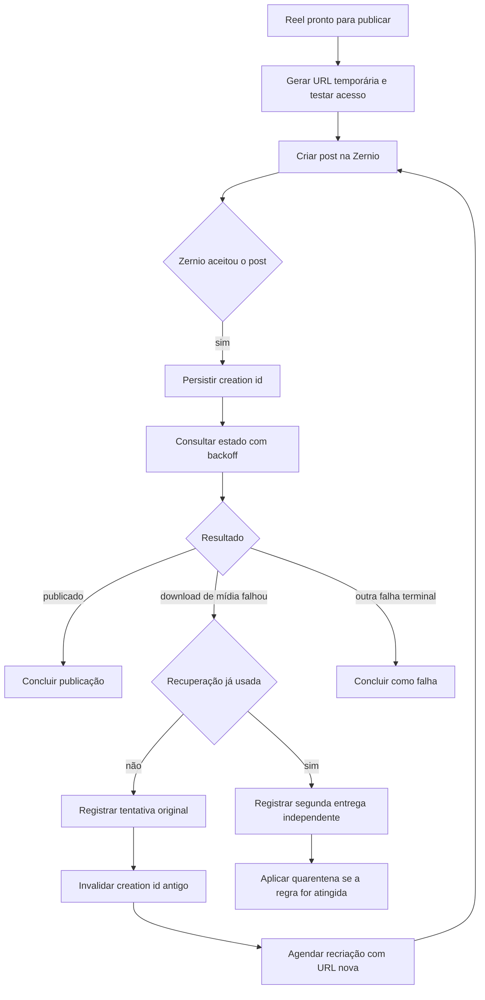

# Plano: Recuperação de Reels Zernio, Diagnóstico Compacto e Confirmação de Falhas

## Decisões aprovadas

- Não incluir validação técnica de codec, container, duração, resolução ou FPS no upload.
- Recuperar automaticamente um Reel uma única vez quando Instagram/Zernio retornar uma falha terminal de download da mídia.
- A recuperação deve criar um novo post Zernio com URL recém-emitida, jamais repetir o polling de um post já terminal.
- `Limpar falhas` será confirmação visual auditável: oculta as falhas confirmadas e zera contadores ativos, sem apagar eventos e sem mudar o status terminal do item.
- O diagnóstico técnico não pode aparecer por inteiro na lista da fila.

## Evidência do incidente

O item `b5485e9d-2ead-487d-a8b2-a2fadcfe7e77` do lote `15-08 44 LOIRINHA` foi aceito pela Zernio com o `creation_id` `6a8003b4d952c593fbbdd39f`. Instagram depois retornou `platform_error`: não conseguiu baixar o vídeo da URL de mídia.

A URL foi validada pela Athena antes do envio e permanece acessível na checagem posterior: `HEAD 200`, `GET Range 206`, `video/mp4` e tamanho esperado. Assim, não há evidência de objeto ausente, expiração ou MIME errado. A falha está no caminho externo Instagram/Zernio depois que o post foi criado.

Os cinco eventos de falha ocorreram contra o mesmo `creation_id` e a mesma fingerprint; não são cinco novos envios nem cinco entregas independentes. A correção deve impedir essa repetição e oferecer uma nova tentativa de entrega com nova URL.

## Fluxo alvo para Reel com falha de download

## Implementação

### 1. Persistência e auditoria de recuperação

1. Criar migration para armazenar, por item, a recuperação de entrega Zernio: criação original, criação substituta, fingerprint, motivo, estado e horário.
2. Criar função transacional de recuperação que só aceite uma recuperação automática por item e só opere quando o post atual estiver terminal por download de mídia.
3. A função deve limpar o `creation_id` antigo, programar a nova criação e registrar evento auditável com a relação entre IDs.
4. O post antigo continua no histórico e jamais é confundido com publicação bem-sucedida.
5. A telemetria de entrega deve deduplicar falhas por `publication_item_id`, `creation_id`, código e fingerprint; cinco polls do mesmo post são uma única falha de entrega.

### 2. Worker Zernio

1. Separar claramente post em processamento de post terminal com erro de download.
2. Para `creation_id` em processamento, usar polling com backoff configurado, sem consumir tentativa de envio.
3. Quando a Zernio retornar falha terminal de download, chamar a recuperação uma única vez, gerar URL nova e criar novo post Zernio com chave idempotente de recuperação.
4. Se a criação substituta retornar o mesmo erro, encerrar o item e deixar a regra de duas entregas independentes decidir a quarentena da mídia.
5. Usar uma origem temporária de entrega para provedores que seja separada de previews da aplicação, tenha URL opaca, TTL suficiente, resposta direta, cabeçalhos corretos e suporte a `Range`.
6. A origem original permanece privada. A implementação não transportará vídeo por rota Next/Vercel; a entrega será feita por Storage/CDN apropriado.

### 3. Política de intervalo e limites

| Marco desde a primeira criação Zernio | Estado retornado | Próxima ação |
| --- | --- | --- |
| Imediato | Post aceito | Persistir `creation_id` e agendar o primeiro poll. |
| +1 min | Publicado | Concluir como publicado. |
| +1 min | Falha terminal de download | Encerrar como falha terminal; a recriação automática só é autorizada após a segunda consulta, no marco de +3. |
| +1 min | Ainda processando | Manter a criação original e agendar o segundo poll. |
| +3 min | Publicado | Concluir como publicado. |
| +3 min | Falha terminal de download | Recriar uma única vez com URL nova e agendar confirmação da criação substituta. |
| +3 min | Ainda processando | Manter a criação original e agendar consulta final. |
| +6 min | Criação substituta publicada | Concluir como publicado. |
| +6 min | Criação substituta falhou download ou segue processando | Encerrar sem nova recriação, registrar a entrega independente e avaliar quarentena. |
| +10 min | Criação original ainda processando | Fazer a consulta final; publicado conclui, qualquer outro estado encerra como timeout terminal. |

Há dois polls regulares do post originalmente aceito: +1 e +3 minutos. O poll de +6 minutos existe apenas se uma recriação foi iniciada no +3; ele confirma a criação substituta. A consulta de +10 minutos existe apenas se o post original ainda estava processando no +3. Toda a recuperação possui uma janela rígida de 10 minutos contada da primeira criação Zernio, e nunca haverá uma segunda recriação automática. O worker verifica itens vencidos a cada 5 segundos, mas esse ciclo não reduz os intervalos acima: `next_attempt_at` governa o momento real da próxima ação.

### 4. Diagnóstico e interface

1. Manter em `last_error_message` apenas mensagem operacional compacta: categoria, origem e identificação segura da criação.
2. Guardar diagnóstico técnico sanitizado e estruturado no evento, usando lista permitida de campos em vez de filtrar chaves perigosas depois.
3. Aplicar clamp de duas linhas no cartão, `overflow-wrap:anywhere`, largura mínima zero e comportamento responsivo para impedir vazamento.
4. Exibir no modal detalhes formatados, diagnóstico expansível e cópia controlada, sem URL, token, legenda ou payload integral.

### 5. Limpar falhas

1. Criar estado de confirmação por item e ação, com usuário, data, escopo e contagem em auditoria.
2. Permitir que administrador ou operador confirme falhas por lote ou pelo conjunto visível do filtro.
3. Contadores principais passam a mostrar falhas ativas, excluindo as confirmadas.
4. Itens `failed`, eventos, tentativas, circuit breaker e diagnóstico técnico permanecem preservados.
5. Incluir filtro para mostrar também falhas já confirmadas no histórico.

### 6. Testes e implantação

1. Testar backoff, recuperação única, deduplicação de telemetria e prevenção de recriação duplicada sob concorrência.
2. Testar a quarentena somente após duas criações independentes equivalentes.
3. Testar sanitização de diagnóstico e CSS em resoluções estreitas.
4. Testar autorização e auditoria de confirmação de falhas.
5. Aplicar migrations, validar testes SQL/Node/TypeScript, implantar worker na VPS, reiniciar PM2 e acompanhar a telemetria do próximo Reel.

## Critérios de aceite

- Uma falha externa de download não esgota cinco tentativas sobre o mesmo post Zernio em segundos.
- Um Reel com erro de download recebe no máximo uma recriação automática com URL nova.
- Nenhuma mídia é bloqueada por polls repetidos do mesmo `creation_id`.
- A segunda falha equivalente em criação independente aciona a política de proteção de mídia.
- Nenhum cartão de fila apresenta JSON longo, URL, token ou overflow visual.
- Limpar falhas zera apenas os indicadores ativos e mantém o histórico consultável e auditável.
