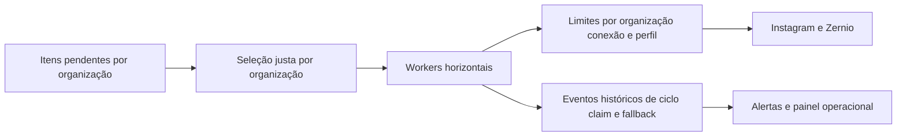
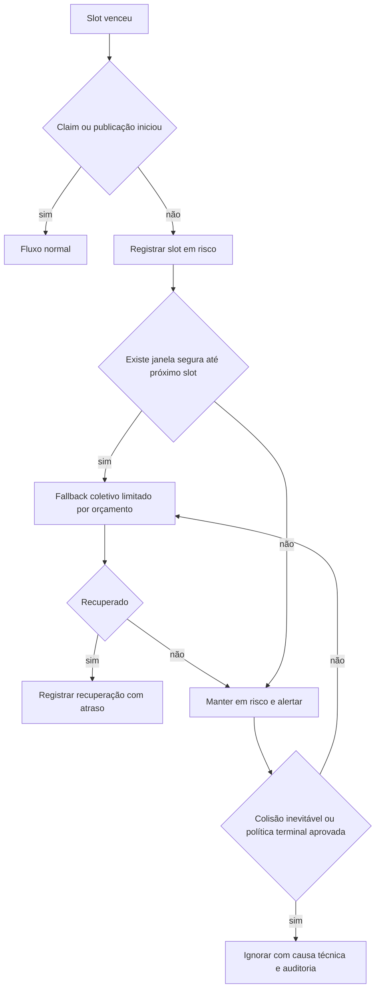

# Plano: Resiliência escalável de slots coletivos e auditoria do worker

## Contexto e incidente de referência

Em 15/08/2026, às 16:16 BRT, a recuperação automática encerrou 38 itens do plano coletivo `15-08 44 LOIRINHA` como `ignored`, incluindo o Reel de `@devasconcelosmariana210`. O horário do slot era 16:14:02 BRT; não existiu claim, preparação, tentativa de publicação ou chamada à Zernio antes da recuperação.

O motivo persistido foi `missed_bulk_slot_ignored`, emitido por [`recover_missed_publication_slots()`](../supabase/migrations/096_ignore_missed_bulk_publication_slots.sql:9). A regra atual encerra qualquer item cuja chave seja `bulk:*` quando o slot atrasa além de `p_grace_seconds`, hoje usado com 120 segundos.

O perfil e a conexão Zernio estavam online depois do evento. Portanto, este caso não foi uma queda de conta, falha individual de mídia ou indisponibilidade do Instagram: foi uma lacuna coletiva de claim/dispatch cuja causa técnica exata não ficou preservada.

## Decisões de produto e operação

- O exemplo de volume discutido não é métrica, limite ou parâmetro fixo do sistema. A solução precisa dimensionar dinamicamente por capacidade, backlog, janela e limites externos.
- Informações de infraestrutura, VPS e workers são exclusivas do superusuário `aleidar1010@gmail.com`. O projeto já centraliza essa identidade em [`isSystemSuperUser()`](../lib/security/super-user.ts:3); a implementação deve reutilizar essa verificação no servidor, sem confiar em controle apenas visual no navegador.
- Nenhuma organização pode monopolizar workers, conexões, banco ou limite externo quando estiver em atraso ou falha.
- Uma onda de erros de uma organização, conexão ou provedor deve permanecer isolada e permitir que as demais organizações continuem publicando.
- Um slot coletivo não pode ser descartado silenciosamente após atraso curto. A decisão final precisa ser auditável e conter causa técnica.
- O fallback futuro só atua em itens ainda pendentes. Itens que já foram `ignored` não podem ser republicados automaticamente, porque não é seguro inferir que não houve publicação externa.
- A recuperação deve preservar a natureza coletiva do slot: não deslocar cada perfil para outro dia/horário de modo independente.
- Antes de mudar regras de descarte, registrar telemetria suficiente para distinguir parada/restart do processo, atraso de polling, falha de claim, indisponibilidade de banco, saturação ou erro de provedor.

## Problema no comportamento atual

A ramificação [`if item_row.idempotency_key like 'bulk:%'`](../supabase/migrations/096_ignore_missed_bulk_publication_slots.sql:56) converte diretamente o item atrasado em `ignored`. Essa regra evita a quebra de cadência, mas trata um atraso transitório de poucos minutos como perda definitiva do conteúdo.

O worker mantém apenas o último estado do heartbeat em [`heartbeat()`](../scripts/workers/publication-worker.mjs:103). Como a linha é atualizada, a telemetria não responde qual ciclo executou antes do incidente, por quanto tempo o worker ficou sem ciclo, por que o claim não ocorreu ou qual dependência falhou.

O claim já é concorrente e seguro contra duplicidade, pois utiliza [`FOR UPDATE SKIP LOCKED`](../supabase/migrations/029_harden_concurrent_publication_worker.sql:98). Contudo, ele ordena a fila global por horário e não estabelece fairness forte por organização; numa operação grande, um backlog ou retry em massa pode consumir capacidade desproporcional.

## Arquitetura alvo

### Estados de um slot coletivo atrasado

## Implementação proposta

### 1. Telemetria histórica e imutável

Criar migration posterior à [`103_schedule_historical_zernio_disconnections.sql`](../supabase/migrations/103_schedule_historical_zernio_disconnections.sql) com:

1. Tabela `publication_worker_cycle_events` para uma linha por início, conclusão ou erro de ciclo. Campos: `worker_id`, `organization_id` opcional, versão, hostname, PID, modalidade, horário de início/fim, duração, capacidade configurada, backlog observado, itens elegíveis, claims, resultados, erro sanitizado e `correlation_id`.
2. Tabela `publication_slot_risk_incidents` única por organização, plano/lote e slot. Campos: horário previsto, atraso, número de itens, próximo slot conhecido, estado, decisão, motivo técnico, worker/ciclo relacionado, totais de tentativa, timestamps e `resolved_at`.
3. Tabela `publication_dispatch_events` ou eventos agregados por ciclo para registrar claim, dispatch, defer, erro de banco, timeout externo e resultado de fallback. Nunca guardar token, URL assinada, legenda ou payload externo completo.
4. Índices por `organization_id`, `created_at`, `slot_execute_at`, `worker_id`, estado e correlação para consultas operacionais sem varredura global.
5. Retenção configurável para eventos granulares e agregação diária para histórico longo. Retenção não pode apagar incidentes, decisões terminais ou erros críticos antes da política de auditoria aprovada.

Modificar [`tick()`](../scripts/workers/publication-worker.mjs:154) para criar um `correlation_id` por ciclo e registrar:

- começo e fim do ciclo;
- duração de leitura, claim, dispatch e recuperação;
- totais por organização selecionada;
- quantidade pendente, vencida, reivindicada, publicada, adiada e falha;
- tipo/código sanitizado de exceção e ponto exato da falha;
- backlog e atraso máximos observados.

O heartbeat atual permanece como visão rápida, mas os eventos se tornam a fonte de diagnóstico histórico.

### 2. Seleção justa e isolamento por organização

Substituir a seleção global pura no claim em [`claim_publication_items()`](../supabase/migrations/029_harden_concurrent_publication_worker.sql:64) por seleção em duas fases:

1. Identificar organizações com itens vencidos/elegíveis.
2. Selecionar uma parcela por organização com round-robin ponderado ou deficit round-robin, usando peso configurável e atraso do item como critérios.
3. Aplicar `FOR UPDATE SKIP LOCKED` aos itens finais para manter segurança entre réplicas.

Regras essenciais:

- Orçamento de concorrência por organização configurável e não codificado para um volume específico.
- Limite simultâneo por conexão Zernio e por perfil.
- Orçamento global configurável para cada classe de worker/provedor.
- Backoff com jitter por organização/conexão, sem concentrar retries no mesmo instante.
- Circuit breaker localizado por organização/conexão/provedor; jamais pause global por falha de uma organização.
- Reivindicação de uma organização deve liberar espaço para as demais a cada rodada.

### 3. Fallback coletivo seguro

Reformular [`recover_missed_publication_slots()`](../supabase/migrations/096_ignore_missed_bulk_publication_slots.sql:9):

1. Após a tolerância inicial, itens `bulk:*` não passam diretamente para `ignored`; criam ou atualizam um incidente `at_risk`.
2. Calcular a janela segura dinamicamente a partir do próximo slot do mesmo plano/lote, do backlog, das cotas da organização, da capacidade atual e dos limites do provedor.
3. Se existir janela segura, habilitar recuperação do slot inteiro com orçamento limitado. O worker processa os itens gradualmente, usando as mesmas regras de claim, limite por conexão e idempotência do fluxo normal.
4. Se não existir capacidade disponível, manter `at_risk`, registrar `capacity_constrained` e alertar; não disparar avalanche nem ignorar silenciosamente.
5. Ignorar somente quando a colisão com o próximo slot for inevitável ou quando uma política terminal explicitamente aprovada determinar isso.
6. A decisão `ignored` deve registrar `decision_reason`, atraso total, próximo slot, capacidade disponível, worker/ciclo e última causa técnica conhecida.
7. Itens já `published`, em lease válido, com `creation_id` ativo ou em confirmação externa ficam fora do fallback e da decisão terminal até o fluxo de idempotência resolver seu estado.

### 4. Proteções de infraestrutura

Atualizar o runbook [`vps-worker-runbook.md`](../docs/vps-worker-runbook.md) e a configuração PM2:

1. Reinício automático em crash com registro de exit code, sinal, horário e contagem de reinícios.
2. Health check externo consultando heartbeat e eventos recentes, não apenas processo vivo.
3. Alerta quando não houver ciclo concluído dentro do SLA configurável, quando existir item vencido sem claim ou quando um slot coletivo entrar em risco.
4. Métricas de CPU, memória, disco, rede e conectividade com Supabase para correlacionar incidentes.
5. Escalonamento horizontal controlado dos workers, preservando claims transacionais e quotas.

### 5. Painel operacional

Adicionar uma seção específica em [`/operacao`](../app/(painel)/operacao/page.tsx) ou rota filha para slots em risco e saúde histórica do worker:

- slots em risco por organização/plano/lote;
- atraso, quantidade afetada, próximo slot e decisão atual;
- causa técnica mais recente e correlação com ciclo/worker;
- backlog e capacidade por organização;
- histórico de reinícios, falhas de ciclo e claims vazios;
- filtros por organização, período, worker, conexão e estado;
- ação operacional futura somente quando aprovada: confirmar encerramento, nunca republicar silenciosamente.

Isso deve ficar separado do relatório de quedas Zernio em [`/operacao/quedas-zernio`](../app/(painel)/operacao/quedas-zernio/page.tsx), porque se trata de confiabilidade do scheduler, não de contas desconectadas.

### 5.1 Controle de acesso para infraestrutura e worker

Separar visibilidade operacional em dois níveis:

1. **Operador da organização:** pode ver somente impactos no próprio conteúdo, como lote em risco, quantidade de itens, atraso, decisão de recuperação e instrução operacional. Não pode ver hostname, PID, versão, IP, uso de CPU/memória/disco, logs de processo, detalhes de rede, configuração, segredos, métricas globais ou dados de outras organizações.
2. **Superusuário:** somente `aleidar1010@gmail.com`, validado no servidor com [`isSystemSuperUser()`](../lib/security/super-user.ts:3), pode acessar saúde de VPS, status e histórico de workers, reinícios PM2, métricas de infraestrutura, backlog global, correlações entre organizações e diagnóstico técnico detalhado sanitizado.

Aplicar a restrição em camadas:

- Rotas/API de telemetria de infraestrutura verificam o usuário autenticado no servidor antes de consultar ou retornar dados.
- RPCs de leitura detalhada exigem `service_role` e só são chamadas por rotas protegidas; RLS não concede tabelas de infraestrutura para usuários autenticados comuns.
- A página administrativa e o link de navegação não são renderizados para não-superusuários, mas essa ocultação é complementar, não substitui autorização no servidor.
- Eventos expostos aos operadores devem passar por projeção permitida, removendo identificadores de host/processo, stack, dados de rede e qualquer dado transversal de organizações.
- Logs continuam sanitizados: mesmo para superusuário, nunca expor token, chave de API, URL assinada, legenda ou payload externo integral.

### 6. Testes e validação de escala

1. Testes SQL de fairness: backlog intenso em uma organização não pode impedir claim das outras.
2. Testes de concorrência com múltiplos workers, leases expirados, reinício durante claim e `SKIP LOCKED`.
3. Testes de fallback: atraso curto recupera sem deslocar cadência; próxima rodada próxima impede avalanche; decisão terminal é auditada.
4. Testes de circuit breaker e backoff isolados por organização/conexão/provedor.
5. Testes de telemetria: cada erro em leitura, claim, dispatch e recuperação produz evento sanitizado correlacionado.
6. Cenários de carga sintética parametrizáveis; não usar a quantidade citada na conversa como limite fixo.
7. Validar latência, filas, uso de banco e respeito aos limites externos antes de ampliar réplicas em produção.

## Ordem de implantação

1. Entregar telemetria histórica, painel de diagnóstico e alertas sem modificar o descarte atual.
2. Coletar evidências para validar o comportamento real sob carga e documentar os motivos de cada slot em risco.
3. Implantar seleção justa por organização com feature flag desligada por padrão e validar em carga sintética.
4. Habilitar fallback coletivo somente para organizações escolhidas, com cotas e alertas.
5. Desativar a conversão automática em dois minutos para `ignored` após a validação do fallback.
6. Expandir horizontalmente workers e revisar limites a partir de métricas observadas.

## Critérios de aceite

- Cada lacuna de dispatch possui cronologia e causa técnica sanitizada consultável, não apenas um `ignored` final.
- Atraso curto não descarta automaticamente uma rodada coletiva quando ainda houver janela segura.
- O fallback não republica automaticamente itens já ignorados nem cria duplicidade externa.
- Uma organização congestionada, em retry ou em circuit breaker não reduz a capacidade das demais além da cota global explicitamente configurada.
- Workers paralelos não duplicam claims, publicações ou decisões de fallback.
- O sistema usa parâmetros configuráveis e métricas observadas, não números fixos derivados de exemplos.
- Cada decisão terminal registra motivo, atraso, próximo slot, worker/ciclo e estado de capacidade.
- Falha de VPS, PM2, banco, rede, claim ou provedor pode ser distinguida pelos eventos persistidos.
