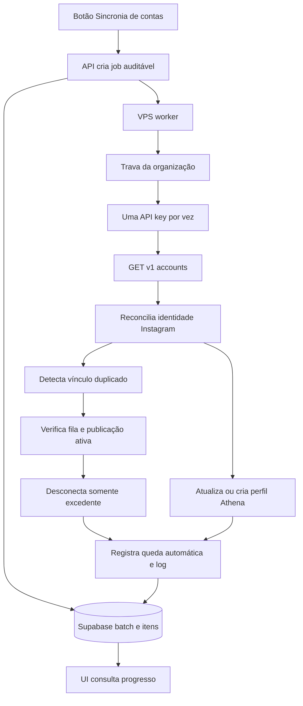

# Plano de resiliência Zernio: sincronia, conflitos e fallback de slots

## Contexto e decisões já confirmadas

- Uma mesma identidade Instagram retornada por duas API keys Zernio, ou por organizações distintas, não pode permanecer conectada duas vezes no Athena.
- Ao identificar um vínculo duplicado comprovado, o Athena deve desconectar a ocorrência excedente na Zernio e registrar uma remoção automática auditável no relatório de quedas.
- A primeira conexão canônica deve ser preservada. A seleção do excedente deve ser determinística e auditada, sem afetar uma publicação que esteja em processamento.
- A sincronia master precisa suportar centenas de chaves, sem depender da duração de uma requisição web da Vercel.

## Problemas confirmados

1. A chave `AnastacioTawes66395` retornava duas contas Instagram ativas na Zernio, mas nenhum perfil correspondente no Athena. Isso caracteriza divergência de reconciliação local após fluxo concorrente de conexão, não perda de acesso remoto.
2. Na organização Vini farmando cash, `@erishimizu67` foi retornado por duas chaves Zernio, com `accountId` remoto diferente. A interface mostrou dois cartões porque o Athena antigo tratava cada `accountId` como identidade independente.
3. O relatório de quedas mostra horário UTC como se fosse horário local. O formatador usa o fuso do navegador em [`formatDate()`](../app/(painel)/operacao/quedas-zernio/page.tsx:23), mas o valor pode ter sido serializado/exibido sem zona ou o navegador pode não estar em America/Sao_Paulo. É necessário padronizar explicitamente o fuso e validar os timestamps persistidos.
4. O botão master atual executa a sincronia dentro da requisição web. Em escala aproximada de 500 chaves, esse modelo pode ultrapassar limites de execução e não oferece progresso por chave suficiente ao operador.
5. O fluxo Bulk lista conexões com slot livre, mas ainda não faz reserva transacional do slot antes da autorização Instagram. Dois celulares podem escolher o mesmo slot antes de a contagem local ser atualizada.

## Instagrams pendentes de conferência manual

Consultar cada API key da organização adequada via `GET /v1/accounts`, sem expor chaves, e cruzar o retorno com perfis locais, tentativas e logs:

- `velvetqor9057`
- `rapidvex7185`
- `brightx87311`
- `titanvex6925`
- `shadowq4819`
- `frostix7352`
- `blazerix8293`
- `thunderzen36183`
- `orbitvex7426`

Para cada username, registrar: chave que o retornou, `accountId`, `profileId` Zernio, estado remoto, perfil Athena correspondente, tentativa/callback que originou o vínculo e motivo de qualquer ausência local. Contas remotas encontradas e ausentes localmente devem ser reconciliadas; nenhuma conta deve ser desconectada nessa fase sem confirmação de conflito duplicado.

## Arquitetura alvo

## Implementação proposta

### 1. Job assíncrono e escalável

1. Converter `zernio_sync_batches` em job com estados `queued`, `processing`, `completed`, `completed_with_errors`, `failed` e `cancelled`.
2. Criar itens por conexão antes do processamento, contendo sequência, status, contadores, timestamps e erro sanitizado.
3. Criar RPC atômica para o worker reivindicar um número limitado de itens com lease e recuperar leases expirados.
4. Criar worker VPS dedicado, semelhante aos workers atuais, para processar a fila com concorrência configurável baixa. A primeira versão deve processar uma chave por organização para preservar a trava e limitar a pressão na Zernio.
5. O endpoint web deve apenas enfileirar ou reutilizar um job ativo e retornar o identificador imediatamente.
6. A tela deve fazer polling do job, exibir `chave atual`, `processadas/total`, contas encontradas, importadas, conflitos, falhas e última mensagem. Ao recarregar a tela, deve recuperar o job ativo ou o último encerrado.

### 2. Conflito de identidade e desconexão automática

1. Preservar o bloqueio global de identidade por username normalizado em [`prevent_zernio_instagram_identity_conflict()`](../supabase/migrations/113_safe_zernio_organization_sync.sql:75).
2. Ao encontrar a mesma identidade em uma segunda chave, eleger a canônica por uma regra estável: vínculo local mais antigo e saudável; em empate, menor `created_at` da conexão.
3. Antes da desconexão do excedente, verificar se ele possui publicação em preparação/publicação, execução recente ou plano em geração. Se existir risco, registrar `remote_removal_pending` e não desconectar automaticamente.
4. Quando seguro, chamar `DELETE /v1/accounts/:accountId` na chave excedente, marcar somente o perfil local excedente como removido e registrar incidente em `zernio_profile_disconnection_incidents` com sinal `zernio_duplicate_identity_auto_removed`.
5. No Relatório de desconexões, mostrar explicitamente: `Removida automaticamente: mesma identidade já conectada na chave X` e a chave preservada. Nunca tratar isso como uma queda acidental.
6. Para conflitos entre organizações, aplicar a mesma proteção, mas exigir uma confirmação adicional de superusuário antes de remover remotamente, porque pode representar uma conta reutilizada de forma intencional em cliente diferente.

### 3. Fallback de slots para conexões simultâneas

1. Não decidir por `instagram_profile_count` exibido apenas na UI. Criar uma reserva de slot por conexão no banco com expiração curta.
2. Quando o operador iniciar uma conexão em lote, o backend reivindica atomicamente uma conexão com capacidade disponível e grava a reserva antes de gerar a URL OAuth.
3. Se a conta inicialmente escolhida estiver cheia, offline, bloqueada por plano ou tiver reserva ativa, selecionar a próxima conexão online com slot livre usando rodada justa.
4. A UI deve exibir um aviso no topo: `A conta selecionada ficou sem slot; a conexão foi encaminhada para <rótulo>`. Se nenhuma chave tiver vaga, não iniciar OAuth e informar `Nenhum slot livre no momento`.
5. Liberar a reserva em callback bem-sucedido, falha, cancelamento ou expiração. O callback deve reconciliar a conta retornada antes de liberar a reserva.
6. Uma tentativa deve ter `connectionId` imutável depois de iniciada; não trocar a chave no meio do OAuth.

### 4. Checkup dos nove perfis e reconciliação

1. Executar diagnóstico de inventário por organização e por chave no VPS ou em script administrativo controlado.
2. Persistir os resultados no mesmo job/auditoria, incluindo as contas encontradas com username pesquisado.
3. Para cada perfil remoto ausente, executar reconciliação idempotente e confirmar que aparece em `/perfis` com provider `zernio`, conexão correta e status remoto.
4. Para cada perfil não encontrado em nenhuma chave, registrar `not_found_in_any_zernio_key` e mostrar qual foi a última tentativa local, sem criar perfil artificial.

### 5. Relatório de quedas e fuso horário

1. Persistir timestamps em UTC, como já ocorre, mas formatar sempre com `timeZone: 'America/Sao_Paulo'` na tela em [`formatDate()`](../app/(painel)/operacao/quedas-zernio/page.tsx:23).
2. Incluir sufixo `BRT` ou `America/Sao_Paulo` no relatório para impedir interpretação ambígua.
3. Auditar `detected_at` e `finalized_at` dos incidentes atuais contra o horário de eventos do worker para identificar registros históricos sem offset ou valores indevidos.
4. Criar teste para verificar que um timestamp UTC é renderizado no horário esperado de São Paulo, inclusive mudança de horário de verão se houver regra futura.

### 6. Notificações no topo

1. Criar uma região de notificações fixa no topo abaixo do cabeçalho da aplicação, visível acima da lista de perfis tanto em desktop quanto em celular.
2. Levar os resultados de conexão, callback, fallback de slot e sincronia para esse canal, com `role=status` ou `role=alert` conforme gravidade.
3. Exibir mensagens duráveis para jobs longos: início, progresso, finalização, conflitos e ação necessária. Não esconder uma falha relevante antes de o operador poder ler.
4. Substituir os avisos locais posicionados abaixo de controles extensos nas telas Perfis e Zernio.

## Critérios de aceite

- O mesmo username Instagram não produz dois cartões ativos no Athena.
- Um conflito na mesma organização remove remotamente apenas o vínculo excedente seguro e aparece no Relatório de desconexões com motivo explícito.
- Um conflito entre organizações não remove automaticamente sem confirmação privilegiada.
- Duas conexões simultâneas não conseguem reservar a mesma vaga Zernio.
- Quando a primeira chave estiver cheia, o sistema seleciona outra chave elegível e informa qual foi usada.
- A sincronia de 500 chaves roda em job VPS retomável, não em uma única requisição web.
- A interface mostra progresso por chave e resultado final recuperável após recarregar a página.
- Os nove usernames foram classificados e, quando presentes remotamente, aparecem nos perfis após reconciliação.
- O relatório de quedas mostra horário de São Paulo consistente e identifica remoções automáticas por duplicidade.
- Resultados de conexão e erros aparecem no topo da tela em dispositivos móveis.

## Segurança operacional

- Nunca registrar API key, token de acesso, URL OAuth integral ou payload remoto completo nos logs.
- Não desconectar automaticamente uma conta com publicação ativa, lote em geração ou evidência insuficiente de que é excedente.
- Não apagar definitivamente perfis, publicações, grupos ou mídia durante reconciliação; usar soft delete e trilha de auditoria.
- Proteger endpoints de job e remoção automática por papel administrativo e validação de organização.
